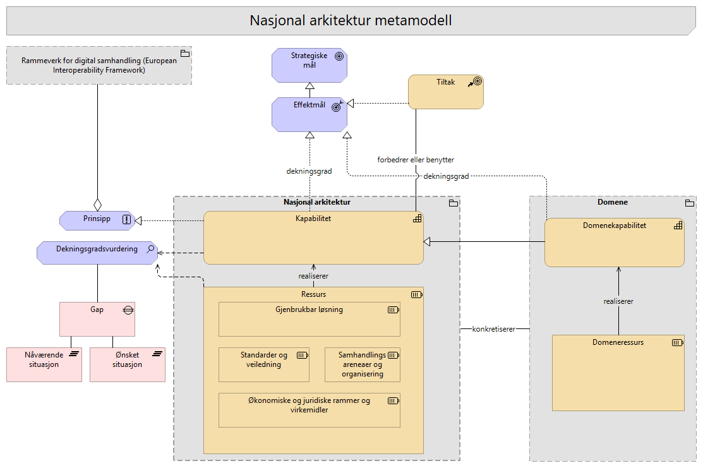

# 001-Metamodell

## Elementer i viewet

### Nåværende situasjon
**Type:** Plateau

---

### Prinsipp
**Type:** Principle

En overordnet og veiledende regel eller retningslinje som er ment å være varig og styrende for alle relevante beslutninger. 
Prinsipper er generelle regler og retningslinjer, ment å være varige og sjelden endres, som informerer og støtter måten en organisasjon går i gang med å oppfylle sitt oppdrag.
Se overordnete arkitekturprinsipper: https://www.digdir.no/digital-samhandling/overordnede-arkitekturprinsipper/1065

Eksempel: "Data skal kun lagres én gang".

EU ELAP: Det europeiske biblioteket for arkitekturprinsipper (ELAP) etablerer prinsipper og rammeverk for å sikre interoperabilitet på europeisk nivå , inkludert det europeiske interoperabilitetsrammeverket (EIF), EU-lovgivning, tilgjengelighet, «Once Only» og mer. Dette biblioteket er et kvalitetssikringsverktøy som også etablerer krav og forretningsprosesser for å muliggjøre interoperabilitet mellom digitale offentlige tjenester.
Se:  https://joinup.ec.europa.eu/collection/common-assessment-method-standards-and-specifications-camss/solution/elap

Togaf definisjon og beste-praksis beskrivelse og definisjon av Arkitekturprinsipper:
https://pubs.opengroup.org/architecture/togaf9-doc/arch/chap20.html

---

### Domeneressurs
**Type:** Resource

Domeneressurs er en konkret ressurs som finnes, forvaltes eller benyttes innenfor et bestemt domene.

En domeneressurs kan være en løsning, tjeneste, standard, datasett, informasjonsmodell, kompetansemiljø, prosess, avtale, infrastruktur eller annen byggekloss som domenet bruker for å realisere egne kapabiliteter.

Domeneressurser knyttes til domenekapabiliteter for å vise hvordan domenets evner faktisk understøttes i praksis. En domeneressurs skal ikke forstås som en spesialisering av en ressurs i Nasjonal arkitektur. Knytningen til Nasjonal arkitektur skjer på kapabilitetsnivå, ved at domenekapabiliteter knyttes til generiske kapabiliteter i Nasjonal arkitektur.

Dette gjør at hvert domene kan beskrive sine egne konkrete ressurser uten at Nasjonal arkitektur må eie, klassifisere eller modellere alle ressurser i detalj. Nasjonal arkitektur gir det felles rammeverket, mens domenet beskriver hvilke ressurser som faktisk finnes og brukes i egen kontekst.

---

### Ønsket situasjon
**Type:** Plateau

---

### Tiltak
**Type:** CourseOfAction

Konkrete tiltak er endringer, initiativer eller leveranser som forbedrer eller benytter kapabiliteter. Et tiltak kan virke på kapabiliteter i Nasjonal arkitektur, på kapabiliteter i et domene, eller på begge nivåer samtidig.
Om tiltaket er nasjonalt, domenespesifikt eller tverrgående fremgår av hvilke kapabiliteter, gap, mål eller effektmål tiltaket knyttes til.
Dette gjør det mulig å vise hvordan samme tiltak kan bidra til nasjonale mål, lukke gap i et domene og samtidig bygge på felles kapabiliteter og ressurser i Nasjonal arkitektur.
Tiltak kan være pågående eller planlagt.
Tiltaket kan forbedre eller realisere en kapabilitet, men er også avhengig av kapabiliteter som finnes.

- Tiltak forbedrer kapabiliteter slik at effektmål oppnås
- Tiltak benytter kapabiliteter (og ressurser) slik at effekten oppnås
- Tiltak reduserer gap.
- Tiltak bidrar til effektmål for å vise hvilken ønsket virkning tiltaket skal bidra til

---

### Økonomiske og juridiske rammer og virkemidler
**Type:** Resource

Dette er økonomiske og juridiske virkemidler som muliggjør gjennomføring.

Rammer og virkemidler kan være ressurser som er
* Finansielle
* Regulative

---

### Domenekapabilitet
**Type:** Capability

Domenekapabilitet er en konkret eller spesialisert kapabilitet innenfor et bestemt domene.

En domenekapabilitet beskriver hva et domene må kunne gjøre for å realisere egne mål, effektmål, tjenester eller samhandlingsbehov. Domenet kan være en sektor, virksomhet, kommunal sektor, fagområde, EU data space eller annet avgrenset område.

Domenekapabiliteter brukes til å konkretisere Nasjonal arkitektur i en bestemt kontekst. De kan knyttes til relevante generiske kapabiliteter i Nasjonal arkitektur for å vise sporbarhet, sammenheng og gjenbruk av felles rammer. Dette gjør det mulig å sammenligne behov og gap på tvers av domener, uten at Nasjonal arkitektur må beskrive alle domenespesifikke detaljer.

En domenekapabilitet kan realiseres eller understøttes av én eller flere domeneressurser.

---

### Domene
**Type:** Grouping

Et domene kan være en sektor, en virksomhet, kommunal sektor, et fagområde, et EU data space eller et annet europeisk område. Domenet kan beskrive egne spesialiseringer, behov, kapabiliteter, ressurser, tiltak og mål, men bør koble disse til relevante generiske kapabiliteter og ressurser i Nasjonal arkitektur. På den måten kan lokale og domenespesifikke arkitekturer utvikles videre uten at Nasjonal arkitektur må modellere alle detaljer. Et domene knytter seg til Nasjonal arkitektur og konkretiserer den i egen kontekst.

Knytningen til Nasjonal arkitektur går primært via domenekapabilitet til nasjonal kapabilitet.

---

### Kapabilitet
**Type:** Capability

En kapabilitet beskriver "hva" en eller flere aktører må kunne gjøre for å skape verdi, uavhengig av hvordan det gjøres. Dette er den forretningsmessige evnen til å oppnå et mål.
En kapabilitet er en grunnleggende funksjonell evne i det digitale økosystemet. Den beskriver hva som må være på plass for å oppnå ønskede mål, uavhengig av organisatoriske grenser og tekniske løsninger.

I Nasjonal arkitektur brukes kapabiliteter til å beskrive hvilke evner som må være til stede i felles økosystem for å oppnå mål, effektmål, samhandling og sammenhengende tjenester. En kapabilitet beskriver behovet på et stabilt og løsningsuavhengig nivå, og skal ikke forveksles med konkrete systemer, prosjekter, tiltak eller organisatoriske enheter.

Den konkrete kapabilitetsmodellen for Nasjonal arkitektur er organisert i tre nivåer:

- **Nivå 1: Overordnet kapabilitet** beskriver den samlede evnen Nasjonal arkitektur skal bidra til i felles økosystem.
- **Nivå 2: Hovedkapabilitet** beskriver brede, strategiske kapabilitetsområder som strukturerer modellen.
- **Nivå 3: Underkapabilitet** beskriver mer konkrete og operasjonelle evner som kan vurderes, forbedres og kobles til ressurser, tiltak, gap og effektmål.

Alle nivåene modelleres som ArchiMate 'Capability'. Nivåene uttrykker abstraksjonsnivå og struktur i modellen, ikke ulike metamodellelementer.
Kapabiliteter er knyttet til ressurser som realiserer eller understøtter dem. Forvaltning av kapabilitetene er en kontinuerlig strategisk prosess som gjøres i dekningsgradsvurderinger opp mot strategiske mål.

---

### Strategiske mål
**Type:** Goal

Målene fra Digitaliseringsstrategien.

---

### Gap
**Type:** Gap

Definerer den spesifikke mangelen (assosiert med analyse av dekningsgrad Nasjonal arkitektur)

---

### Nasjonal arkitektur
**Type:** Grouping

Nasjonal arkitektur beskriver det generiske og tverrgående nivået i felles økosystem for digital samhandling.

Gruppen viser hvilke begreper som hører til Nasjonal arkitektur som felles rammeverk.

---

### Ressurs
**Type:** Resource

Ressurser er konkrete byggeklosser som realiserer ønskede kapabiliteter og løser konkrete behov.
En ressurs er noe økosystemet har eller kan bruke for å understøtte én eller flere kapabiliteter. Det kan være tekniske løsninger, standarder, veiledning, informasjonsmodeller, datasett, organisatoriske arenaer, kompetansemiljøer, avtaler, finansielle virkemidler eller juridiske rammer.

Ressurser kategoriseres etter hva slags type byggekloss de er. I Nasjonal arkitektur kan dette for eksempel være gjenbrukbare løsninger, standarder og veiledning, samhandlingsarenaer og organisering, eller økonomiske og juridiske rammer og virkemidler.

---

### Dekningsgradsvurdering
**Type:** Assessment

Identifiserer svakheter og dekningsgrad i dagens arkitektur, vurdert opp mot mål, effektmål, behov og ønsket situasjon.

Assessment brukes til å dokumentere hvor godt kapabiliteter og ressurser dekker et bestemt behov, et bestemt effektmål eller en ønsket fremtidig tilstand. Vurderingen gir grunnlag for å identifisere gap, prioritere tiltak og vurdere om økosystemet har nødvendige evner og byggeklosser for å nå ønskede effekter.

### Hva som vurderes

En assessment kan brukes til å vurdere både kapabiliteter og ressurser.

For kapabiliteter vurderes hvor godt evnen er dekket i dagens situasjon sammenlignet med ønsket nivå. Dette kan for eksempel uttrykkes som:

- målverdi
- dagens verdi
- gap mellom dagens verdi og målverdi
- modenhet
- begrunnelse for vurderingen

For ressurser vurderes hvor godt en konkret ressurs realiserer eller understøtter én eller flere kapabiliteter, behov eller effektmål. Dekningsgrad bør derfor vurderes i kontekst, ikke som én global score for ressursen.

Eksempel: Fellesløsningen `Maskinporten` kan ha ulik dekningsgrad avhengig av hvilken kapabilitet eller hvilket effektmål den vurderes mot:

- Dekningsgrad for kapabilitet `Tilgangsstyring`: `[1-5]`
- Dekningsgrad for kapabilitet `Representasjon`: `[1-5]`
- Dekningsgrad for effektmål `Sømløs system-til-system-samhandling`: `[1-5]`

Dette gjør det mulig å vise at samme ressurs kan være godt egnet for ett behov, men ha lavere dekningsgrad for et annet.

### Gap og modenhet

Gap beregnes som avstanden mellom dagens verdi og ønsket målverdi.

- **Rødt (Gap > 2):** Kapabiliteter eller ressurser der avstanden mellom nåsituasjon og mål er kritisk stor. Her bør tiltak prioriteres.
- **Gult (Gap = 1):** Kapabiliteter eller ressurser som er på vei mot ønsket nivå, men som krever vedlikehold, oppfølging eller mindre forbedringer.
- **Grønt (Gap = 0):** Kapabiliteten eller ressursen har nådd ønsket målverdi.

Måling av kapabilitetsmodenhet hjelper med å synliggjøre gapet mellom nåsituasjon (`as-is`) og ønsket fremtidig situasjon (`to-be`). Dette gir grunnlag for å prioritere hvor innsatsen bør settes inn.

Modenheten til en kapabilitet vurderes blant annet basert på tilstanden til de underliggende ressursene som realiserer eller understøtter kapabiliteten.

### Ressurser og måling

Ressurser kan vurderes med indikatorer som viser hvor godt de understøtter kapabiliteter og effektmål.

Aktuelle indikatorer kan være:

- **Dekningsgrad (1-5):** I hvilken grad ressursen faktisk er tilgjengelig, moden og egnet til å støtte en bestemt kapabilitet, et behov eller et effektmål.
- **Funksjonell egnethet (Functional Fit):** Hvor godt ressursen støtter behovet, prosessen eller tjenesten den skal bidra til.
- **Teknisk egnethet (Technical Fit):** Hvor moderne, stabil, sikker og teknisk egnet ressursen er.
- **Livssyklusstatus:** Om ressursen er i aktiv bruk, under innføring, under utfasing eller ved slutten av livsløpet.

Eksempler på livssyklusstatus:

- `Live`
- `Phasing Out`
- `End of Life`

Assessment kan også brukes til å lage heatmaps som viser dekningsgrad, egnethet, modenhet og gap på tvers av kapabiliteter, ressurser, domener eller effektmål.

### POTI-basert ressursvurdering

POTI kan brukes som analysemodell for å vurdere ressursenes rolle og tilstand.

POTI står for:

- **Prosess:** Arbeidsflyter, rutiner og prosedyrer som ressursen understøtter eller påvirker.
- **Organisasjon:** Roller, ansvar, kompetanse, styring, samhandling og kapasitet knyttet til ressursen.
- **Teknologi:** Systemer, applikasjoner, infrastruktur, grensesnitt og tekniske løsninger som ressursen består av eller bygger på.
- **Informasjon:** Data, metadata, informasjonsmodeller, datakvalitet, tilgjengelighet og informasjonsflyt som ressursen forvalter eller gjør mulig.

POTI brukes ikke som erstatning for ressurskategoriene i Nasjonal arkitektur. Ressurser kan fortsatt kategoriseres som for eksempel gjenbrukbare løsninger, standarder og veiledning, samhandlingsarenaer og organisering, eller økonomiske og juridiske rammer og virkemidler.

POTI brukes som et analyseperspektiv på tvers av disse kategoriene. En ressurs kan vurderes ut fra om den primært påvirker prosesser, organisering, teknologi eller informasjon. Mange ressurser vil berøre flere POTI-dimensjoner samtidig.

### Hvorfor bruke POTI i vurderingen

POTI gjør det mulig å analysere om ressursene samlet sett er tilstrekkelige for å realisere en kapabilitet.

En kapabilitet kan for eksempel ha god teknologistøtte, men likevel lav samlet dekningsgrad dersom prosesser, organisering, kompetanse eller informasjonsgrunnlag mangler. På samme måte kan en ressurs være teknisk moden, men ha lav funksjonell egnethet dersom den ikke støtter arbeidsprosessene eller behovene godt nok.

POTI er særlig nyttig når man skal:

- forstå nåsituasjon og ønsket fremtidig situasjon
- identifisere styrker, svakheter og forbedringsområder
- vurdere om organisasjonen er rigget for å gjennomføre strategien
- prioritere tiltak for å lukke gap
- analysere konsekvenser av digital transformasjon, omorganisering eller innføring av nye teknologiske løsninger

### Eksempler på vurderingsspørsmål

For **prosess** kan vurderingen stille spørsmål som:

- Hvilke arbeidsflyter, rutiner og prosedyrer understøttes av ressursen?
- Er prosessene dokumenterte og etterlevd?
- Bidrar ressursen til mer effektiv og sammenhengende oppgaveløsning?

For **organisasjon** kan vurderingen stille spørsmål som:

- Er roller og ansvar tydelig definert?
- Finnes nødvendig kompetanse og kapasitet?
- Er organisasjonen rigget for å forvalte og bruke ressursen?

For **teknologi** kan vurderingen stille spørsmål som:

- Hvilke verktøy, systemer eller tekniske løsninger er i bruk?
- Er løsningene integrerte, brukervennlige, sikre og skalerbare?
- Hvor godt støtter teknologien automatisering, samarbeid eller datadrevne beslutninger?
- Finnes det teknisk gjeld eller avhengigheter som påvirker egnetheten?

For **informasjon** kan vurderingen stille spørsmål som:

- Er informasjonen nøyaktig, tilgjengelig og forståelig?
- Hvordan deles, gjenbrukes og analyseres data på tvers?
- Er datakvaliteten tilstrekkelig?
- Er datasett, begreper, informasjonsmodeller eller API-er registrert i relevante kataloger, for eksempel Felles datakatalog?
- Er virksomheten i tilstrekkelig grad i orden i eget hus?

### Sammenheng med mål, prinsipper og tiltak

En kapabilitet kan bidra til å realisere både mål, effektmål og prinsipper. Den viser hvordan en organisasjon, et domene eller det nasjonale økosystemet faktisk implementerer, oppfyller eller tolker hensikten bak et mål eller prinsipp i praksis.

Assessment gjør det mulig å vurdere om kapabilitetene og ressursene har tilstrekkelig dekningsgrad til å nå ønskede effekter. Dersom vurderingen avdekker gap, kan konkrete tiltak prioriteres for å styrke kapabiliteter, forbedre ressurser eller redusere avstanden mellom dagens situasjon og ønsket situasjon.

### Se også

De konkrete resultatene av å bruke kapabilitetene kan vurderes i sammenheng med indikatorer og dybdemålinger fra Digitaliseringsstrategien.

Se på dybdeindikatorene fra nullpunktsmåling:

https://www.digdir.no/rikets-digitale-tilstand/nullpunktmaling-digitaliseringsstrategien-fremtidens-digitale-norge/7416

Eksempler:

- https://www.digdir.no/rikets-digitale-tilstand/sorge-en-sikker-og-fremtidsrettet-digital-infrastruktur-kap-32/7429
- https://www.digdir.no/rikets-digitale-tilstand/forsterke-styring-og-samordning-i-offentlig-sektor-kap-31/7428

---

### Effektmål
**Type:** Outcome

De konkrete resultatene av å bruke kapabilitetene. Kapabiliteter beskriver hva økosystemet må kunne gjøre for å oppnå effekter.
Tiltak bidrar positivt til å nå effektmål.

Se på dybdeindikatorene fra nullpunktsmåling:
https://www.digdir.no/rikets-digitale-tilstand/nullpunktmaling-digitaliseringsstrategien-fremtidens-digitale-norge/7416
F.eks:
* https://www.digdir.no/rikets-digitale-tilstand/sorge-en-sikker-og-fremtidsrettet-digital-infrastruktur-kap-32/7429
* https://www.digdir.no/rikets-digitale-tilstand/forsterke-styring-og-samordning-i-offentlig-sektor-kap-31/7428

---

### Rammeverk for digital samhandling (European Interoperability Framework)
**Type:** Grouping

Rammeverk for digital samhandling.
https://www.digdir.no/digital-samhandling/rammeverk-digital-samhandling/2148

Bakgrunnsinformasjon og opprinnelse:
EU har utviklet European Interoperability Framework (EIF), et felles rammeverk for digital samhandling. Målet er å fremme digital samhandling på tvers av landegrenser og innenfor hvert enkelt land. Norge forpliktet seg til å implementere EIF da vi undertegnet Tallinn-erklæringen i 2017, sammen med EU og andre EFTA-land.

Som et resultat har Norge etablert sitt eget nasjonale rammeverk for interoperabilitet (NIF- National Interoperability Framework), som i dag heter "Rammeverk for digital samhandling". Den første versjonen ble utarbeidet som et Skate-tiltak i 2018.

---

### Standarder og veiledning
**Type:** Resource

Ressurser som setter regler eller gir retning.

Dette kan være:
Standarder, veiledere, referansearkitekturer, metodikk
Normeringsgrad kan være knyttet til disse virkemidlene.

---

### Gjenbrukbar løsning
**Type:** Resource

Gjenbrukbare løsninger er tekniske komponenter, applikasjoner som leverer funksjonalitet eller dataprodukter og dekker behov på tvers av eller innenfor sektorer, og/eller forvaltningsnivå. 
En nasjonal fellesløsning er en byggekloss som offentlige virksomheter kan dra nytte av i sine digitale tjenester. Løsningene utvikles én gang og kan deretter brukes av mange.
De viktigste fellesløsningene kalles nasjonale felleskomponenter: Altinn, Digital postkasse til innbyggere, Enhetsregisteret, Folkeregisteret, ID-porten, Kontakt- og reservasjonsregisteret og Matrikkelen. Noen er obligatoriske å bruke, andre er anbefalte - både for statlige virksomheter og for kommunal sektor.

Strategiske prinsipper for nasjonale felleskomponenter (gammel))
https://www.digdir.no/media/395/download
https://www.regjeringen.no/contentassets/fe3e34b866034b82b9c623c5cec39823/no/pdfs/stm201520160027000dddpdfs.pdf

Fellesløsning eller felles løsning:
* Forskjellen er institusjonell. 
* Fellesløsning:  referer til nasjonale fellesløsninger, som er spesifikk tekniske komponenter som skal kunne brukes av svært mange i offentlig sektor for å løse generiske behov. 
* Felles løsning: Gjenbrukbar løsnning som kan benyttes av flere og med formåk om samarbeid og stordriftsfordeler, men uten nødvendigvis å ha status som en nasjonal komponent i økosystemet.
* Fellestjeneste: Den forretningsmessige eller tekniske funksjonaliteten som tilbys.

Sluttbrukertjenester: Det innbyggeren eller næringslivet opplever (f.eks. "Søke om barnehageplass" eller "Levere skattemelding"). 
Støttetjenester: Tekniske tjenester som ikke er synlige for sluttbrukeren, men som er nødvendige for at systemene skal snakke sammen (f.eks. gjennom et API)

De nasjonale felleskomponentene, slik de er definert i Digital agenda:
– Har en statlig virksomhet som forvaltningsansvarlig.
– Dekker behov på tvers av mange sektorer og/eller forvaltningsnivå.
– Vil være sentrale komponenter i en rekke digitale tjenester.
– Er av stor samfunnsøkonomisk betydning som felles mulighetsrom for digital tjenesteutvikling og gevinstrealisering i virksomhetene.

---

### Samhandlingsareneaer og organisering
**Type:** Resource

Organiserte nettverk og styringsorganer for både dialog og strategisk samarbeid og samordning.

Eksempler:
* Samstyringsstruktur i kommunal sektor
* Skate
* ASR (Arkitektur- og standardiseringsrådet)
* Faglig arena for datadeling og informasjonsforvaltning
* Datalandsbyen
* Offentlig PAAS - Slack for alle i offentlig sektor

---

