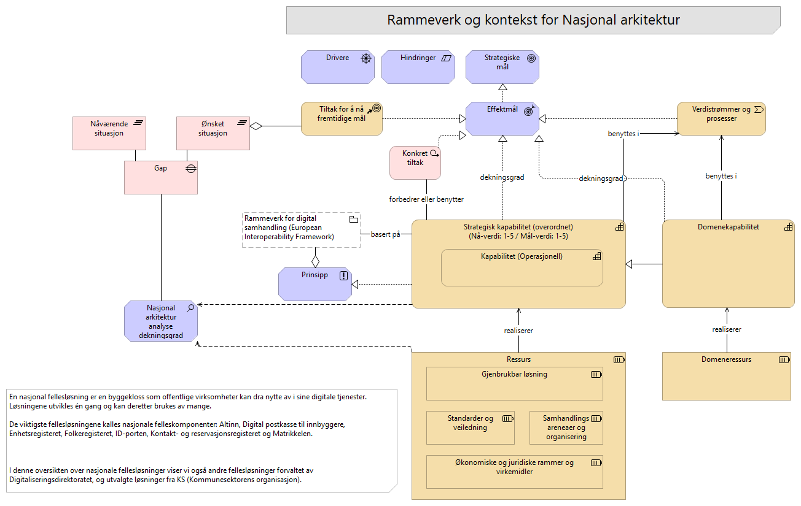

# 002-Metamodell kontekst

## Elementer i viewet

### Nåværende situasjon
**Type:** Plateau

---

### Strategiske mål
**Type:** Goal

Målene fra Digitaliseringsstrategien.

---

### Domenekapabilitet
**Type:** Capability

---

### Gjenbrukbar løsning
**Type:** Resource

Gjenbrukbare løsninger er tekniske komponenter, applikasjoner som leverer funksjonalitet eller dataprodukter og dekker behov på tvers av eller innenfor sektorer, og/eller forvaltningsnivå. 

Tekniske løsninger som utvikles én gang og brukes av mange.
Fellesløsninger er byggeklosser som kan brukes i utviklingen av offentlige digitale tjenester. Noen er obligatoriske å bruke, andre er anbefalte - både for statlige virksomheter og for kommunal sektor.

Fellesløsning til forretningstjenester, som er forretningsaktivitet med et spesifisert resultat og som støtter et spesifikt forretningsmål. 
Den er brukersentert og representerer funksjonalitet som leverer verdi til en ekstern bruker. 
Brukerorienterte eller funksjonelle tjenester som leverer verdi, ofte på tvers av løsninger.

Merk:
Selv om en tjeneste bruker teknologi, er selve "tjenesten" (f.eks. eSignering eller Autentisering) det funksjonelle resultatet av en prosess rettet mot en bruker

Strategiske prinsipper for nasjonale felleskomponenter (gammel - bør ha en felles beskrivelse av felles-"løsninger" i stedet)
https://www.digdir.no/media/395/download
https://www.regjeringen.no/contentassets/fe3e34b866034b82b9c623c5cec39823/no/pdfs/stm201520160027000dddpdfs.pdf

Fellesløsning vs. felles løsning:
* Forskjellen er institusjonell. 
* Fellesløsning:  referer til nasjonale fellesløsninger, som er spesifikk tekniske komponenter som skal kunne brukes av svært mange i offentlig sektor for å løse generiske behov. 
* Felles løsning: Gjenbrukbar løsnning som kan benyttes av flere og med formåk om samarbeid og stordriftsfordeler, men uten nødvendigvis å ha status som en nasjonal komponent i økosystemet.
* Fellestjeneste: Den forretningsmessige eller tekniske funksjonaliteten som tilbys.

Sluttbrukertjenester: Det innbyggeren eller næringslivet opplever (f.eks. "Søke om barnehageplass" eller "Levere skattemelding"). 
Støttetjenester: Tekniske tjenester som ikke er synlige for sluttbrukeren, men som er nødvendige for at systemene skal snakke sammen (f.eks. gjennom et API)

De nasjonale felleskomponentene, slik de er definert i Digital agenda:
– Har en statlig virksomhet som forvaltningsansvarlig.
– Dekker behov på tvers av mange sektorer og/eller forvaltningsnivå.
– Vil være sentrale komponenter i en rekke digitale tjenester.
– Er av stor samfunnsøkonomisk betydning som felles mulighetsrom for digital tjenesteutvikling og gevinstrealisering i virksomhetene.

---

### Drivere
**Type:** Driver

"Drivere" er den grunnleggende motivasjonen eller årsaken til at en endring settes i gang.

Drivarar og hindringar må sjåast i samanheng. Dei viktigaste hindringane er økonomiske rammer og kapasitet. 
Ei styrking her vil vere blant dei viktigaste drivarane for å oppnå resultat og realisere gevinstar av teknisk infrastruktur og data, knytt til handheving av eit stadig meir omfattande regelverk.

---

### Standarder og veiledning
**Type:** Resource

Ressurser som setter regler eller gir retning.

Dette kan være:
Standarder, veiledere, referansearkitekturer, metodikk
Normeringsgrad kan være knyttet til disse virkemidlene.

---

### Tiltak for å nå fremtidige mål
**Type:** CourseOfAction

Dette er tiltak som realiserer eller gjør endringer på en eller flere kapabiliteter.

Tiltakslisten (123) fra Digitaliseringsstrategien følges opp, i tillegg til andre relavante tiltak som bidrar til målene.

---

### Gap
**Type:** Gap

Definerer den spesifikke mangelen (assosiert med analyse av dekningsgrad Nasjonal arkitektur)

---

### Prinsipp
**Type:** Principle

En overordnet og veiledende regel eller retningslinje som er ment å være varig og styrende for alle relevante beslutninger. 
Prinsipper er generelle regler og retningslinjer, ment å være varige og sjelden endres, som informerer og støtter måten en organisasjon går i gang med å oppfylle sitt oppdrag.
Se overordnete arkitekturprinsipper: https://www.digdir.no/digital-samhandling/overordnede-arkitekturprinsipper/1065

Eksempel: "Data skal kun lagres én gang".

EU ELAP: Det europeiske biblioteket for arkitekturprinsipper (ELAP) etablerer prinsipper og rammeverk for å sikre interoperabilitet på europeisk nivå , inkludert det europeiske interoperabilitetsrammeverket (EIF), EU-lovgivning, tilgjengelighet, «Once Only» og mer. Dette biblioteket er et kvalitetssikringsverktøy som også etablerer krav og forretningsprosesser for å muliggjøre interoperabilitet mellom digitale offentlige tjenester.
Se:  https://joinup.ec.europa.eu/collection/common-assessment-method-standards-and-specifications-camss/solution/elap

Togaf definisjon og beste-praksis beskrivelse og definisjon av Arkitekturprinsipper:
https://pubs.opengroup.org/architecture/togaf9-doc/arch/chap20.html

---

### Økonomiske og juridiske rammer og virkemidler
**Type:** Resource

Dette er økonomiske og juridiske virkemidler som muliggjør gjennomføring.

Rammer og virkemidler kan være ressurser som er
* Finansielle
* Regulative

---

### Verdistrømmer og prosesser
**Type:** ValueStream

Verdistrøm representerer en sekvens av aktiviteter som skaper et samlet resultat for en kunde, interessent eller sluttbruker.

Nasjonal arkitektur skal være kunnskaps- og datadrevet, og skal inneholde informasjon som skal kunne gjenbrukes i ulike verdistrømmer. Den skal inneholde viktige kapabiliteter og rammer for samhandling i felles økosystem, og den skal inneholde oversikt over hvilke løsninger og ressurser som kan benyttes for å dekke behov.  

Det kan være ulike verdistrømmer for ulike brukergrupper og for ulike behov.
* Operasjonelle verdistrømmer, der Nasjonal arkitektur inngår som en verktøykasse for daglige oppgaver. F.eks. tjenesteutvikling og produktutvikling.
Målgruppe: Utførere, planleggere
* Strategiske verdistrømmer, der Nasjonal arkitektur bidrar til at man tar valg for fremtiden
Målgruppe: Beslutningstagere, planleggere

---

### Effektmål
**Type:** Outcome

De konkrete resultatene av å bruke kapabilitetene.
Se på dybdeindikatorene fra nullpunktsmåling:
https://www.digdir.no/rikets-digitale-tilstand/nullpunktmaling-digitaliseringsstrategien-fremtidens-digitale-norge/7416
F.eks:
* https://www.digdir.no/rikets-digitale-tilstand/sorge-en-sikker-og-fremtidsrettet-digital-infrastruktur-kap-32/7429
* https://www.digdir.no/rikets-digitale-tilstand/forsterke-styring-og-samordning-i-offentlig-sektor-kap-31/7428

---

### Rammeverk for digital samhandling (European Interoperability Framework)
**Type:** Grouping

Rammeverk for digital samhandling.
https://www.digdir.no/digital-samhandling/rammeverk-digital-samhandling/2148

Bakgrunnsinformasjon og opprinnelse:
EU har utviklet European Interoperability Framework (EIF), et felles rammeverk for digital samhandling. Målet er å fremme digital samhandling på tvers av landegrenser og innenfor hvert enkelt land. Norge forpliktet seg til å implementere EIF da vi undertegnet Tallinn-erklæringen i 2017, sammen med EU og andre EFTA-land.

Som et resultat har Norge etablert sitt eget nasjonale rammeverk for interoperabilitet (NIF- National Interoperability Framework), som i dag heter "Rammeverk for digital samhandling". Den første versjonen ble utarbeidet som et Skate-tiltak i 2018.

---

### Nasjonal arkitektur analyse dekningsgrad
**Type:** Assessment

Identifiserer svakheter i dagens arkitektur (ressurser og kapabiliteter). Er en faglig analyse som forklarer hvorfor gapet finnes.

Kapabiliteter og grad av nåsituasjon og måloppnåelse 
- målverdi
- dagens verdi
= Finner Gap og modenhet:
Rødt (Gap > 2): Kapabiliteter der avstanden mellom nåsituasjon og mål er kritisk stor. Her må Tiltak (Work Packages) prioriteres.
Gult (Gap = 1): Kapabiliteter som er i rute, men krever vedlikehold eller mindre justeringer.
Grønt (Gap = 0): Kapabiliteten har nådd sin målverdi.
En kapabilitet kan realisere både mål og prinsipper, altså beskrive hvordan organisasjonen faktisk implementerer, oppfyller eller tolker hensikten bak prinsippet i praksis.
Modenhetsmodell, som CMMI (Capability Maturity Model Integration):
* Måling av kapabilitetsmodenhet (Capability Maturity) hjelper deg å prioritere hvor innsatsen bør settes inn ved å synliggjøre gapet mellom "hvor gode vi er" (As-Is) og "hvor gode vi må være" (To-Be).
* Modenheten til en kapabilitet vurderes basert på tilstanden til de underliggende ressursene.

Ressurser og måling:
* Kan vises som en heatmap med indikatorer for:
- Dekningsgrad kapabilitet (1-5) for å indikere i hvilken grad en ressurs faktisk er tilgjengelig eller moden nok til å støtte ønsket kapabilitet.
- egnethet (Funksjonelt egnet)
- Teknisk egnet
- Livssyklus status

Man kan også benytte POTI modell som vurdering på tilstanden til ressursene:
* People (Organisasjon): Roller og kompetanse.
* Process (Prosess): Arbeidsflyter og prosedyrer.
* Technology (Teknologi): IT-systemer og infrastruktur.
* Information (Informasjon): Datakvalitet og flyt

Se også:
De konkrete resultatene av å bruke kapabilitetene.
Se på dybdeindikatorene fra nullpunktsmåling:
https://www.digdir.no/rikets-digitale-tilstand/nullpunktmaling-digitaliseringsstrategien-fremtidens-digitale-norge/7416
F.eks:
* https://www.digdir.no/rikets-digitale-tilstand/sorge-en-sikker-og-fremtidsrettet-digital-infrastruktur-kap-32/7429
* https://www.digdir.no/rikets-digitale-tilstand/forsterke-styring-og-samordning-i-offentlig-sektor-kap-31/7428

---

### Ressurs
**Type:** Resource

Ressurs (med hva):
Ressursene er de konkrete byggeklossene som realiserer ønskede kapabiliteter, og løser konkrete behov.
En ressurs er noe vi har (byggeklossene) som løser et konkret behov eller krav til funksjonalitet, og som bidrar til å realisere en eller flere kapabiliteter.

Mrk: Ved måling av ressurser så kan vi måle hver enkelt ressurs iht POTI-laget den tilhører.
Ressursene er ulike typer (POTI), og må derfor måles med ulike kriterier

Mrk:
* En generisk kategorisering med få kategorier, men som knyttes til kapabilitetene for ytterligere kategorisering

Måling av Teknologi (Applikasjoner/Systemer):
* Teknisk tilstand (Technical Fit): Er koden sunn? Er det teknisk gjeld? Er leverandøren stabil?
* Forretningsverdi (Functional Fit): Støtter den prosessen godt nok? Er brukerne fornøyde?
Technical_Fit (Score 1–5): Hvor moderne/stabil er teknologien?
Functional_Fit (Score 1–5): Hvor godt dekker den behovet?
Lifecycle_Status: (F.eks. "Live", "Phasing Out", "End of Life").

Måling av Folk (Kompetanse/Kapasitet)

POTI-rammeverket, som står for Prosesser, Organisasjon, Teknologi og Informasjon, er en modell som brukes innen virksomhetsarkitektur for å analysere og beskrive de sentrale elementene i en organisasjon. Rammeverket sikrer en helhetlig tilnærming til endring og utvikling ved å belyse hvordan disse fire områdene henger sammen og påvirker hverandre.
POTI fungerer som et analytisk verktøy for å forstå både nåværende tilstand ("as-is") og en ønsket fremtidig tilstand ("to-be") i en virksomhet. Ved å systematisk gå gjennom hvert av de fire elementene, kan arkitekter og beslutningstakre identifisere styrker, svakheter og forbedringsområder. Dette er spesielt nyttig i forbindelse med digital transformasjon, omorganiseringer eller implementering av nye teknologiske løsninger.

* Prosess
* Organisasjon/Mennesker
* Teknologi
* Informasjon

De fire pilarene i POTI

* Prosesser: Dette omfatter arbeidsflyter og prosedyrer som virksomheten benytter for å levere verdi. Analyse av prosesser ser på hvordan oppgaver utføres, rekkefølgen på aktiviteter, og hvordan man kan optimalisere disse for økt effektivitet og kvalitet.
* Organisasjon: Dette elementet fokuserer på menneskene og strukturen i virksomheten. Det inkluderer roller, ansvar, kompetanse, organisasjonskart og kultur. En analyse vil se på om organisasjonen er rigget for å støtte prosessene og strategiske mål.
* Teknologi: Her ser man på IT-systemer, applikasjoner, infrastruktur og andre teknologiske verktøy som understøtter prosessene. Vurderingen går på om teknologien er formålstjenlig, moderne, sikker og godt integrert.
* Informasjon: Dette dekker data og informasjon som virksomheten produserer, bruker og forvalter. Analyse av informasjonsaspektet ser på datakvalitet, tilgjengelighet, sikkerhet og hvordan informasjon flyter mellom prosesser og systemer.

Målet er å sikre at man er rigget for å gjennomføre strategien effektivt.

### Teknologi (Technology)
Teknologi er en kritisk muliggjører for ytelse og innovasjon. I denne dimensjonen vurderes:
* Hvilke verktøy og systemer er i bruk?
* Er de integrerte, brukervennlige og skalerbare?
* Hvor godt støtter de automatisering, samarbeid eller datadrevne beslutninger?

Evaluering av teknologi bidrar til å avdekke muligheter for digital transformasjon og konkurransefortrinn.

### Informasjon (Information)
Dette fokuserer på kvaliteten, flyten og bruken av data:
* Er informasjonen nøyaktig og tilgjengelig?
* Orden i eget hus (se på modenhetsmodellen?)
* Hvordan deles og analyseres data på tvers?
* Datakvalitet
* Felles datakatalog registrert?

## Hvorfor bruke POTI-analyse?

POTI er spesielt nyttig når en organisasjon:
* Planlegger en transformasjon eller omstrukturering.
* Tar i bruk nye teknologier eller systemer.
* Utvider eller skalerer driften.
* Søker større effektivitet eller virkning.

Ved å bruke dette rammeverket kan selskaper utvikle et veikart for «nåsituasjon vs. fremtidig situasjon» og prioritere viktige tiltak for å lukke gap.

---

### Strategisk kapabilitet (overordnet)
**Type:** Capability

En kapabilitet beskriver "hva" en eller flere aktører må kunne gjøre for å skape verdi, uavhengig av hvordan det gjøres. Dette er den forretningsmessige evnen til å oppnå et mål.
En kapabilitet er en grunnleggende funksjonell evne i det digitale økosystemet. Den beskriver hva som må være på plass for å oppnå felles nasjonale mål, uavhengig av organisatoriske grenser og tekniske løsninger.

Kapabiliteter er typisk uttrykt med generelle termer og på høyt nivå. For at en kapabilitet skal nås kreves evner i form av ferdigheter gjennom en kombinasjon av ulike ressurser. 

Prosesser, Organisasjon/mennesker, Teknologi, Informasjon (POTI).

Kapabiliteter og grad av måloppnåelse
- målverdi
- dagens verdi
= Finner Gap og modenhet 
En kapabilitet kan realisere både mål og prinsipper, altså beskrive hvordan organisasjonen faktisk implementerer, oppfyller eller tolker hensikten bak prinsippet i praksis.
Modenhetsmodell, som CMMI (Capability Maturity Model Integration):
* Måling av kapabilitetsmodenhet (Capability Maturity) hjelper deg å prioritere hvor innsatsen bør settes inn ved å synliggjøre gapet mellom "hvor gode vi er" (As-Is) og "hvor gode vi må være" (To-Be).
* Modenheten til en kapabilitet vurderes basert på tilstanden til de underliggende ressursene.

Se også:
De konkrete resultatene av å bruke kapabilitetene.
Se på dybdeindikatorene fra nullpunktsmåling:
https://www.digdir.no/rikets-digitale-tilstand/nullpunktmaling-digitaliseringsstrategien-fremtidens-digitale-norge/7416
F.eks:
* https://www.digdir.no/rikets-digitale-tilstand/sorge-en-sikker-og-fremtidsrettet-digital-infrastruktur-kap-32/7429
* https://www.digdir.no/rikets-digitale-tilstand/forsterke-styring-og-samordning-i-offentlig-sektor-kap-31/7428

Hvordan vurdere modenhet? Gjør dette iht POTI
People (Folk/Organisasjon): Har vi riktig kompetanse og nok hoder?
Process (Prosess): Er rutinene dokumenterte og etterlevd?
Technology (Teknologi): Har vi verktøystøtte som fungerer?
Information (Informasjon): Er "innholdet" (dataene, kunnskapen, veiledningen)

Togaf om Kapabilitetsplanlegging:
https://pubs.opengroup.org/architecture/togaf9-doc/arch/chap28.html

---

### Domeneressurs
**Type:** Resource

---

### Kapabilitet (Operasjonell)
**Type:** Capability

---

### Konkret tiltak
**Type:** WorkPackage

Realiserer endringer som fjerner gap. Dette er konkrete tiltak som har startet eller er planlagt.
Tiltaket kan forbedre eller realisere en kapabilitet, men er også avhengig av kapabiliteter som finnes.

---

### Samhandlingsareneaer og organisering
**Type:** Resource

Organiserte nettverk og styringsorganer for både dialog og strategisk samarbeid og samordning.

Eksempler:
* Samstyringsstruktur i kommunal sektor
* Skate
* ASR (Arkitektur- og standardiseringsrådet)
* Faglig arena for datadeling og informasjonsforvaltning
* Datalandsbyen
* Offentlig PAAS - Slack for alle i offentlig sektor

---

### Ønsket situasjon
**Type:** Plateau

---

### Hindringer
**Type:** Constraint

Hindringer: Hva stopper eller begrenser oss?

---

<small>Sist oppdatert: 3. juli 2026</small>
