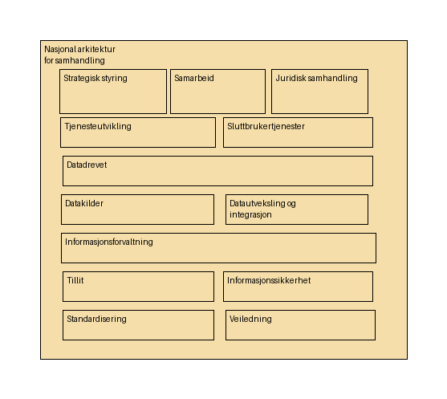

# 01-NA Hovedkapabiliteter

## Kapabiliteter

- **Nasjonal arkitektur for samhandling** - *Evne til å sikre samhandling, gjenbruk og strategisk retning i et nasjonalt digitalt økosystem.*
  - **Veiledning** - *Evne til at veiledninger for digital samhandling utarbeides og benyttes i felles økosystem.*
  - **Sluttbrukertjenester** - *Evne til å tilby en sammenhengende digital brukeropplevelse gjennom et økosystem av standardiserte og integrerbare tjenester.*
  - **Samarbeid** - *Evne til å samarbeid og samhandling på tvers av offentlig og privat forvaltning.*
  - **Datakilder** - *Evne til å tilgjengeliggjøre og forvalte data som en nasjonal fellesressurs, slik at de kan oppdages, forstås og gjenbrukes på en sikker og standardisert måte.*
  - **Tillit** - *Evne å tilby tillitstjenester som muliggjører autentisering og autorisasjon på tvers av tjenestekjeder, og støtte en distribuert arkitektur og føderering mellom ulike domener og tjeneste*
  - **Datadrevet** - *Evne til å systematisk bruke data som en strategisk ressurs for å skape innsikt, informere beslutninger og utvikle bedre, mer treffsikre og effektive tjenester.*
  - **Informasjonssikkerhet** - *Evne til å ha tilstrekkelig sikkerhet i tjenester og løsninger som benyttes i felles økosystem.*
  - **Tjenesteutvikling** - *Evne til å utvikle sammenhengende digitale tjenester.*
  - **Informasjonsforvaltning** - *Evne til å ha et felles rammeverk og styringsmodell for informasjonsforvaltning, slik at offentlige virksomheter kan utveksle og dele data og beskrivelser.*
  - **Datautveksling og integrasjon** - *Evne til å sikkert, effektivt og standardisert utveksle data mellom aktører i økosystemet.*
  - **Standardisering** - *Evne til å identifisere, vedta, forvalte og fremme bruk av omforente standarder og spesifikasjoner som sikrer interoperabilitet og gjenbruk på tvers av sektorer og landegrenser.*
  - **Strategisk styring** - *Evnen til å sette retning for nasjonal arkitektur og realisere strategiske mål.*
  - **Juridisk samhandling** - *Evne til å etablere, forvalte og formidle et helhetlig juridisk rammeverk som muliggjør og regulerer sikker og effektiv digital samhandling.*

<small>Sist oppdatert: 3. juli 2026</small>

<small>Sist oppdatert: 16. juli 2026</small>
