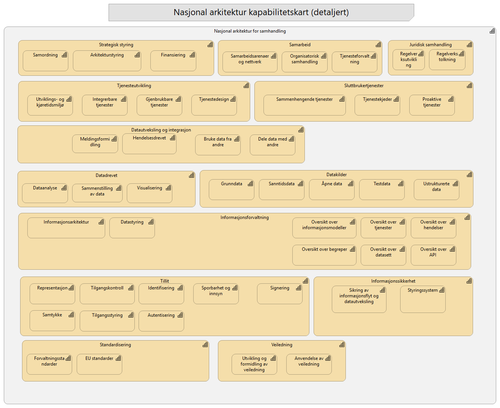

# 02-Nasjonal Arkitektur Kapabilitetskart

## Kapabiliteter

- **Nasjonal arkitektur for samhandling** - *Evne til å sikre samhandling, gjenbruk og strategisk retning i et nasjonalt digitalt økosystem.*
  - **Tillit** - *Evne å tilby tillitstjenester som muliggjører autentisering og autorisasjon på tvers av tjenestekjeder, og støtte en distribuert arkitektur og føderering mellom ulike domener og tjeneste*
    - **Tilgangskontroll** - *Evne til å kontrollere at en bruker har rettighet til å benytte angitt ressurs eller tjeneste på vegne av andre eller seg selv.*
    - **Tilgangsstyring** - *Evne til å styre og gi tilgang til hvem som har rettighet til å benytte en ressurs (tjeneste, system, API, opplysning) på vegne av seg selv, andre personer eller virksomheter.*
    - **Identifisering** - *Evne til entydig å fastslå og registrere identiteter (personer, virksomheter eller systemer) gjennom pålitelige metoder og kilder.*
    - **Signering** - *Evne til juridisk bindende signerering av dokumenter eller transaksjoner*
    - **Samtykke** - *Evne til å akseptere, godkjenne eller gi tillatelse til at en handling kan foretas på vegne av seg selv eller andre, der det foreligger et representasjonsforhold.*
    - **Representasjon** - *Evne til å kunne opptre eller utføre handlinger digitalt på vegne av andre.*
    - **Autentisering** - *Evne til å på en sikker og entydig måte verifisere den digitale identiteten til brukere og systemer*
    - **Sporbarhet og innsyn** - *Evne til dokumentasjon og logging av oppysninger for bruk i innsyn, forvaltning og kontroll av tillitstjenester.*
  - **Sluttbrukertjenester** - *Evne til å tilby en sammenhengende digital brukeropplevelse gjennom et økosystem av standardiserte og integrerbare tjenester.*
    - **Sammenhengende tjenester** - *Evne til å levere en digital brukerorienterte tjenester som fremstår som en logisk og uavbrutt prosess for brukeren, selv når den involverer og koordinerer handlinger og tjenester fra flere, uavhengige virksomheter.*
    - **Tjenestekjeder** - *Evne til å dynamisk sette sammen, koordinere og automatisere flyten av informasjon og prosesser på tvers av uavhengige, integrerbare tjenester for å levere en komplett ende-til-ende-tjeneste for brukeren.*
    - **Proaktive tjenester** - *Evne til å, basert på registrerte hendelser og delte data, automatisk identifisere en brukers behov for offentlige tjenester og proaktivt tilby relevant informasjon, veiledning eller starte en tjenesteprosess på vegne av brukeren.*
  - **Datautveksling og integrasjon** - *Evne til å sikkert, effektivt og standardisert utveksle data mellom aktører i økosystemet.*
    - **Dele data med andre** - *Evne til å tilgjengeliggjøre egne data som veldokumenterte og sikre API-er, slik at andre aktører med lovlig grunnlag enkelt kan oppdage og gjenbruke dem.*
    - **Bruke data fra andre** - *Evne til å gjenbruke data fra andre i egne tjenester og prosesser.*
    - **Meldingsformidling** - *Evnen til å garantere levering og meldingsrekkefølge til rett mottaker.*
    - **Hendelsesdrevet** - *Evne til å publisere og reagere på digitale hendelser og kontinuerlige datastrømmer når de inntreffer.*
  - **Standardisering** - *Evne til å identifisere, vedta, forvalte og fremme bruk av omforente standarder og spesifikasjoner som sikrer interoperabilitet og gjenbruk på tvers av sektorer og landegrenser.*
    - **EU standarder** - *Evnen til at EU standardene forstås og tas i bruk.*
    - **Forvaltningsstandarder** - *Evne til å implementere og ta i bruk nasjonale standarder*
  - **Strategisk styring** - *Evnen til å sette retning for nasjonal arkitektur og realisere strategiske mål.*
    - **Finansiering** - *Evne til å utforme, anvende og forvalte finansielle virkemidler for å styre digitalisering i økosystemets i tråd med nasjonale mål*
    - **Arkitekturstyring** - *Evne til å etablere, forvalte og styre en helhetlig nasjonal digital arkitektur som et felles, forpliktende rammeverk, for å sikre samhandling, gjenbruk og strategisk retning i et nasjonalt digitalt økosystem*
    - **Samordning** - *Evnen til å harmonisere og koordinere strategisk retning, beslutninger og ressursbruk på tvers av virksomheter, for å realisere felles samfunnsmål og sammenhengende tjenester.*
  - **Tjenesteutvikling** - *Evne til å utvikle sammenhengende digitale tjenester.*
    - **Utviklings- og kjøretidsmiljø** - *Evne til å tilby og forvalte en felles, skalerbar teknisk plattform og en tilhørende verktøykasse med standardiserte byggeklosser, verktøy og utviklingsmiljøe som forenkler og akselererer utviklingen av digitale tjenester.*
    - **Integrerbare tjenester** - *Evne til å designe, utvikle og eksponere data og funksjonalitet som selvstendige, standardiserte og maskinlesbare tjenester (API-er), slik at de enkelt kan oppdages, forstås og integreres i nye, tverrgående prosesser og løsninger.*
    - **Gjenbrukbare tjenester** - *Evne til å utvikle og benytte tjenester som kan brukes i nye sammenhenger på tvers av offentlig forvaltning og næringsliv.*
    - **Tjenestedesign** - *Evne til å sette brukerens behov, livssituasjon og helhetlige reise som utgangspunkt for utvikling av sammenhengende tjenester.*
  - **Informasjonssikkerhet** - *Evne til å ha tilstrekkelig sikkerhet i tjenester og løsninger som benyttes i felles økosystem.*
    - **Styringssystem** - *Evne til å evaluere, forbedre, fornye styringssystem for informasjonssikkerhet.*
    - **Sikring av informasjonsflyt og datautveksling**
  - **Informasjonsforvaltning** - *Evne til å ha et felles rammeverk og styringsmodell for informasjonsforvaltning, slik at offentlige virksomheter kan utveksle og dele data og beskrivelser.*
    - **Oversikt over informasjonsmodeller** - *Evne til å gi oversikt over informasjonsmodeller for å kunne gi en felles forståelse av datastrukturer, slik at data kan tolkes korrekt og meningsfullt.*
    - **Oversikt over datasett** - *Evne til å systematisk oppdage, vurdere og gjenbruke data på tvers av offentlig sektor gjennom en sentral, standardisert oversikt over tilgjengelige datasett.*
    - **Oversikt over hendelser** - *Evne til å få oversikt over hvilke hendelser som utløser eller utløses av en tjeneste.*
    - **Oversikt over API ** - *Evne til å datadeling og tjenesteintegrasjon ved å oppdage, forstå og koble seg til tilgjengelige data via en standardisert oversikt over maskinlesbare grensesnitt (API-er).*
    - **Oversikt over begreper** - *Evne til å etablere en omforent begrepsforståelse ved å definere, dele og gjenbruke begreper på tvers av virksomheter, for å sikre entydig kommunikasjon og semantisk samhandlingsevne*
    - **Oversikt over tjenester** - *Evne til å gi oversikt over og oppdage tjenester som tilbys av eller på vegne av offentlig sektor.*
    - **Datastyring** - *Evne til å sikre enhetlig og ansvarlig forvaltning av dataressurser gjennom felles rammeverk, klar ansvarsplassering og systematisk kvalitetsarbeid.*
    - **Informasjonsarkitektur** - *Evne til å strukturere og modellere informasjon på en standardisert måte, slik at data og innhold blir finnbart, forståelig og gjenbrukbart for både mennesker og maskiner på tvers av hele økosystemet.*
  - **Datakilder** - *Evne til å tilgjengeliggjøre og forvalte data som en nasjonal fellesressurs, slik at de kan oppdages, forstås og gjenbrukes på en sikker og standardisert måte.*
    - **Sanntidsdata** - *Evne til å sikkert prosessere og distribuere kontinuerlige datastrømmer for å muliggjøre sanntidsinnsikt, automatisering og umiddelbar respons.*
    - **Åpne data** - *Evne til å tilgjengeliggjøre åpne data slik at den kan leses og tolkes av både maskiner og mennesker, og som alle kan få tilgang til, bruke og dele.*
    - **Grunndata** - *Evne til å identifisere og formelt anerkjenne autoritative datakilder basert på en systematisk vurdering av deres verdi.*
    - **Testdata** - *Evne til å generere og tilgjengeliggjøre representative og personvernsikre datasett.*
    - **Ustrukturerte data** - *Evne til å tilgjengeliggjøre og forvalte data som ikke er påført en forhåndsdefinert struktur.*
  - **Datadrevet** - *Evne til å systematisk bruke data som en strategisk ressurs for å skape innsikt, informere beslutninger og utvikle bedre, mer treffsikre og effektive tjenester.*
    - **Dataanalyse** - *Evnen til å transformere rådata til meningsfull innsikt og bygge prediktive modeller.*
    - **Sammenstilling av data** - *Evne til å hente, kombinere og foredle data fra ulike kilder for å skape ny innsikt, et helhetlig beslutningsgrunnlag, eller sammenhengende tjenester for brukeren.*
    - **Visualisering** - *Evne til å omforme komplekse data til visuelle fremstillinger som gjør innsikt lett tilgjengelig, forståelig og anvendbar.*
  - **Samarbeid** - *Evne til å samarbeid og samhandling på tvers av offentlig og privat forvaltning.*
    - **Organisatorisk samhandling** - *Evnen til å effektivisere forretningsprosesser og verdikjeder på tvers av organisatoriske grenser.*
    - **Samarbeidsarenaer og nettverk** - *Evne til å effektivisere, etablere, forvalte og fasilitere arenaer, nettverk og prosesser som fremmer kunnskapsdeling, dialog og samordning på tvers av virksomheter i økosystemet.*
    - **Tjenesteforvaltning** - *Evne til å formalisere samarbeid gjennom tydelig definerte roller, ansvar og avtaler for å sikre forutsigbar og effektiv felles styring mellom samhandlende virksomheter.*
  - **Juridisk samhandling** - *Evne til å etablere, forvalte og formidle et helhetlig juridisk rammeverk som muliggjør og regulerer sikker og effektiv digital samhandling.*
    - **Regelverksutvikling** - *Evne til å foreslå og koordinere endringer i regelverket for å tilpasse det til teknologisk utvikling og nye behov.*
    - **Regelverkstolkning** - *Evne til å tilby felles, autoritative tolkninger av relevant regelverk.*
  - **Veiledning** - *Evne til at veiledninger for digital samhandling utarbeides og benyttes i felles økosystem.*
    - **Anvendelse av veiledning** - *Evne til tolke og benytte veiledere i prosjekter og tiltak.*
    - **Utvikling og formidling av veiledning** - *Evne til å utarbeide, kvalitetssikre og tilgjengeliggjøre veiledning.*

<small>Sist oppdatert: 3. juli 2026</small>
