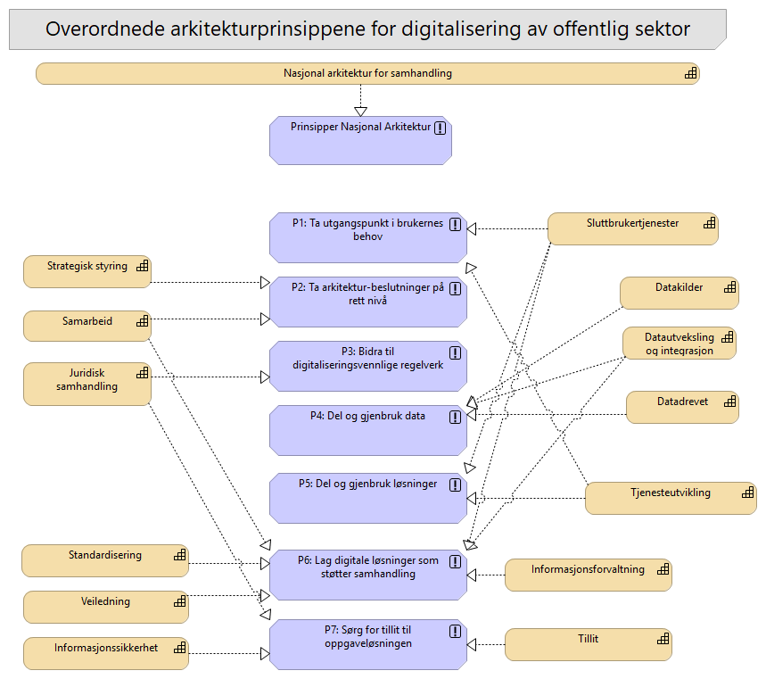

# 03-Arkitekturprinsipper og NA

> **Merk:** Denne dokumentasjonen skal forbedres! Inntil videre kan du få tilgang til all dokumentasjon ved å **[Åpne interaktiv Archi-rapport](interaktiv-modell.md)**.

## Beskrivelse

Denne viser (grovt) relasjonene mellom nasjonale arkitekturprinsipper og Nasjonal arkitektur hovedkapabiliteter (Nivå 2)
https://www.digdir.no/digital-samhandling/prinsipp-1-ta-utgangspunkt-i-brukernes-behov/1055

## Elementer i viewet

### Nasjonal arkitektur for samhandling
**Type:** Capability

Evne til å sikre samhandling, gjenbruk og strategisk retning i et nasjonalt digitalt økosystem.

Felles økosystem skal bidra til økt deling av data og gjenbruk av løsninger, slik at vi utnytter ressursene på en effektiv måte og skaper økte verdier for samfunnet.
Det betyr at i felles økosystem samarbeider aktørene om å utvikle fellesløsninger som bidrar til en effektiv forvaltning med gode brukervennlige tjenester. Dette inkluderer hvordan vi styrer og forvalter løsninger og tjenester, samt hvordan vi øker samhandlingen mellom aktørene. 
Med samhandling mener vi evnen til å tilby tjenester, utveksle informasjon og ivareta både de organisatoriske, juridiske, semantiske og tekniske aspektene ved dette.

---

### Datadrevet
**Type:** Capability

Evne til å systematisk bruke data som en strategisk ressurs for å skape innsikt, informere beslutninger og utvikle bedre, mer treffsikre og effektive tjenester.

### Begrunnelse (Hvorfor)
Kapabiliteten skal sikre at forvaltningen systematisk bruker data som en strategisk ressurs i prosesser, beslutningstaking og tjenesteutvikling for å levere bedre og mer effektive tjenester til innbyggere og næringsliv. Den forutsetter åpenhet, deling av data og evne til å hente ut verdi fra data gjennom blant annet analyse, automatisering og bruk av kunstig intelligens.

### Hva det innebærer (Omfang)
- **Juridisk (Høy vekt):** Etisk og ansvarlig datautnyttelse krever at all bruk av data skjer på en sikker, lovlig og etisk forsvarlig måte som ivaretar personvern og rettssikkerhet.
- **Organisatorisk (Høy vekt):** Virksomhetene må etablere styring, kompetanse, prosesser og ansvar som gjør data til en aktiv del av beslutninger, tjenesteutvikling og forbedringsarbeid.
- **Semantisk (Høy vekt):** Felles begreper, metadata, informasjonsmodeller og datakvalitet må sikre at data kan forstås og brukes riktig på tvers av virksomheter.
- **Teknisk (Høy vekt):** Analyseplattformer, automatisering, KI-verktøy, datadeling og sikker teknisk infrastruktur må gjøre det mulig å hente ut verdi fra data i praksis.

### Bidrag til sammenhengende tjenester og felles økosystem
Kapabiliteten gjør det mulig å bruke data til å forstå behov, forutse hendelser og utvikle mer treffsikre tjenester på tvers av virksomheter. Når data brukes systematisk og ansvarlig, kan offentlig sektor gå fra reaktiv saksbehandling til mer proaktive, personaliserte og effektive tjenesteløp. Dette styrker det felles økosystemet ved å gjøre data til et felles grunnlag for innsikt, prioritering, automatisering og kontinuerlig forbedring.

---

### P1: Ta utgangspunkt i brukernes behov
**Type:** Principle

https://www.digdir.no/digital-samhandling/prinsipp-1-ta-utgangspunkt-i-brukernes-behov/1055

---

### Tjenesteutvikling
**Type:** Capability

Evne til å utvikle sammenhengende digitale tjenester.

### Begrunnelse (Hvorfor)
Offentlig og privat sektor må øke digitaliseringstakten for å løse felles samfunnsutfordringer og unngå fragmenterte løsninger. Denne hovedkapabiliteten eksisterer som en strategisk paraply for å styrke den felles prosess- og kompetanseevnen på tvers av økosystemet. Den løser problemet med silobasert og isolert systemutvikling ved å samordne innsatsen rundt helhetlig metodikk, design, koding og samarbeid.

### Hva det innebærer (Omfang)
- **Organisatorisk (Svært høy vekt):** Felles smidige metodikker, brukerorienterte designdrevne prosesser og tverrgående samarbeidsmodeller sikrer helhetlig produktutvikling.
- **Semantisk (Middels vekt):** Nasjonale referansemodeller og omforent begrepsforståelse legges systematisk til grunn under modellering av nye tjenestegrensesnitt.
- **Teknisk (Høy vekt):** Overordnede plattformstrategier for standardiserte byggeklosser, integrerbare API-er og felles kjøretidsmiljøer sikrer teknologisk samsvar.

### Bidrag til sammenhengende tjenester og felles økosystem
Hovedkapabiliteten gir det strategiske fundamentet som kreves for at uavhengige virksomheter skal kunne bygge løsninger som fungerer sømløst sammen. Ved å harmonisere kompetansen innen design, koding og gjenbruk på et overordnet nivå, elimineres metodiske ulikheter før utviklingen starter. For sluttbrukeren betyr dette at nye tverrgående tjenestekjeder kan etableres raskere, slik at de oppleves helhetlig og uavbrutt.

---

### Tillit
**Type:** Capability

Evne å tilby tillitstjenester som muliggjører autentisering og autorisasjon på tvers av tjenestekjeder, og støtte en distribuert arkitektur og føderering mellom ulike domener og tjeneste.

### Begrunnelse (Hvorfor)
Kapabiliteten gir et felles tillitsgrunnlag for digital samhandling på tvers av virksomheter, domener og tjenestekjeder. Den fungerer som en strategisk paraply for identifisering, autentisering, tilgangsstyring, tilgangskontroll, representasjon, samtykke, signering, sporbarhet og innsyn.

Uten felles tillitstjenester må hver virksomhet etablere egne mekanismer for identitet, autorisasjon og sporbarhet. Det gir fragmenterte løsninger, svakere sikkerhet, lavere gjenbruk og mer krevende integrasjon mellom tjenester.

### Hva det innebærer (Omfang)
- **Juridisk (Høy vekt):** Overordnede rettslige rammer for eID, autorisasjon, representasjon, samtykke, signering, personvern og digitale tillitstjenester må sikre at samhandling kan skje lovlig og etterprøvbart.
- **Organisatorisk (Høy vekt):** Felles forvaltningsmodeller, roller, ansvar og avtaler må sikre at tillitstjenester kan brukes og videreutvikles på tvers av virksomheter og sektorer.
- **Semantisk (Middels vekt):** Felles begreper for identitet, rettighet, representasjon, samtykke, tillitsnivå, autentisering og autorisasjon må sikre lik forståelse i økosystemet.
- **Teknisk (Svært høy vekt):** Fødererte tillitstjenester, felles autentiserings- og autorisasjonsmekanismer, tokenforvaltning, logging, signering og sporbarhet må gjøre det mulig å etablere tillit på tvers av distribuerte tjenester.

### Bidrag til sammenhengende tjenester og felles økosystem
Tillit gjør det mulig å koble tjenester sammen på tvers av virksomheter uten at hver aktør må etablere egne løsninger for identitet, tilgang, representasjon og sporbarhet. Når tillitstjenester fungerer på tvers, kan brukere og systemer bevege seg tryggere gjennom en tjenestekjede der rettigheter, fullmakter og handlinger kan verifiseres.

Kapabiliteten styrker det felles økosystemet ved å gi felles mekanismer for sikker samhandling, juridisk etterprøvbarhet og teknisk føderering mellom domener. For sluttbrukeren betyr dette mer sømløse, sikre og tillitvekkende tjenester der offentlige og private aktører kan samhandle uten at brukeren må håndtere kompleksiteten bak.

---

### Standardisering
**Type:** Capability

Evne til å identifisere, vedta, forvalte og fremme bruk av omforente standarder og spesifikasjoner som sikrer interoperabilitet og gjenbruk på tvers av sektorer og landegrenser.

### Begrunnelse (Hvorfor)
Kapabiliteten sikrer at virksomheter i økosystemet bygger tjenester, løsninger og informasjonsutveksling på omforente standarder og spesifikasjoner. Den reduserer lokale avvik, særtilpasninger og teknisk fragmentering, og gjør det mulig å oppnå interoperabilitet og gjenbruk på tvers av sektorer og landegrenser.

### Hva det innebærer (Omfang)
- **Juridisk (Middels vekt):** Nasjonale føringer, forskrifter og EU-harmoniserte standarder må gi forutsigbare rammer for hvilke standarder som skal eller bør brukes.
- **Organisatorisk (Svært høy vekt):** Livssyklusforvaltning må sikre prosesser for å vurdere nye standarder, vedlikeholde eksisterende og fase ut foreldede standarder i takt med teknologisk utvikling.
- **Semantisk (Høy vekt):** Harmonisering må sikre at nasjonale standarder er i samsvar med internasjonale standarder, slik at begreper, data og tjenester kan forstås på tvers.
- **Teknisk (Høy vekt):** Standarder og spesifikasjoner må gjøre det mulig å bygge tekniske grensesnitt, formater og løsninger som fungerer sammen og kan gjenbrukes.

### Bidrag til sammenhengende tjenester og felles økosystem
Standardisering gjør det enklere å utvikle tjenester og løsninger som passer sammen på tvers av virksomheter, sektorer og landegrenser. Veiledning gjør standardene tilgjengelige og forståelige, slik at de enklere kan implementeres i tjenester og løsninger.

Kapabiliteten styrker det felles økosystemet ved å legge til rette for etterlevelse, slik at fellesløsninger og virksomheter faktisk tar i bruk vedtatte forvaltningsstandarder i anskaffelser og utviklingsløp. For sluttbrukeren betyr dette mer stabile, forutsigbare og sammenhengende tjenester, der digitale løsninger følger samme samhandlingsmønstre og lettere kan kobles sammen.

---

### Samarbeid
**Type:** Capability

Evne til å samarbeid og samhandling på tvers av offentlig og privat forvaltning.

### Begrunnelse (Hvorfor)
Sammenhengende tjenester kan ikke bygges i isolasjon. Aktørene i økosystemet må fungere som ett lag for å løse felles utfordringer, unngå dobbeltarbeid og bryte ned silotenking. Denne overordnede pilaren eksisterer for å sikre helhetlig samfunnsverdi og felles strategisk retning. Den løser problemet med at virksomheter prioriterer interne oppgaver fremfor tverrgående brukerreiser.

### Hva det innebærer (Omfang)
- **Organisatorisk (Svært høy vekt):** Overordnede styringsmodeller, samstyring og finansiering koordinerer samhandlingsmodeller og avtaler for å tilpasse tjenestekjeder og prosesser.

### Bidrag til sammenhengende tjenester og felles økosystem
Kapabiliteten bygger bro mellom organisatoriske siloer og sikrer overordnet strategisk koordinering. Når man er enige om prioriteringer, økonomi og spilleregler på forhånd, sikres et tydelig mandat for samarbeid. Dette gir de operative teamene fundamentet de trenger for å binde tjenester sammen til en uavbrutt og guidet reise, slik at sluttbrukeren opplever forvaltningen som én samordnet aktør.

---

### Juridisk samhandling
**Type:** Capability

Evne til å etablere, forvalte og formidle et helhetlig juridisk rammeverk som muliggjør og regulerer sikker og effektiv digital samhandling.

### 1. Begrunnelse (Hvorfor)
Digital samhandling og datadeling på tvers av uavhengige virksomheter krever en trygg og felles juridisk grunnmur. Uten denne kapabiliteten vil uklarheter rundt lovlighet, personvern og deling av opplysninger skape usikkerhet, føre til unødig lange utredningsprosesser og i verste fall stanse utviklingen av tverrgående digitale tjenester fordi aktørene ikke har avklart om de har lov til å samhandle.

### 2. Hva det innebærer (Omfang)
- **Juridisk (Svært høy vekt):** Dette utgjør selve kjernen i kapabiliteten. Det innebærer å foreslå, koordinere og harmonisere endringer i regelverket (regelverksutvikling) samt å tilby felles, autoritative tolkninger av eksisterende regelverk (regelverkstolkning). Det sikrer at det rettslige hjemmelsgrunnlaget for deling av data er på plass og i tråd med nasjonale lover og europeiske forordninger (som GDPR og eIDAS).
- **Organisatorisk (Høy vekt):** Etablere tverrgående samarbeidsarenaer og nettverk mellom jurister, departementer og etater for å samordne forvaltningspraksis. Dette sikrer en koordinert tilnærming til rettslige problemstillinger og fjerner silobaserte tolkninger som hindrer samhandling.
- **Semantisk (Middels vekt):** Oversette komplekse juridiske begreper, vilkår og lovtekster til en omforent forståelse, slik at lovens intensjon tolkes likt av saksbehandlere og virksomheter i hele økosystemet.
- **Teknisk (Lav vekt):** Underbygge prinsippet om digitaliseringsvennlig regelverk, der lover og forskrifter utformes med tanke på at rettslige regler, plikter og rettigheter senere skal kunne omsettes til maskinlesbar logikk og automatiserte saksbehandlingsprosesser.

### 3. Bidrag til sammenhengende tjenester og felles økosystem
Kapabiliteten rydder bort juridiske gråsoner og hindringer bak fasaden, slik at data lovlig kan flyte mellom uavhengige aktører i en tjenestekjede. For sluttbrukeren betyr dette en sømløs opplevelse der det offentlige kan samhandle på tvers av etater uten at brukeren selv må fungere som budbringer av attester, vedtak eller dokumentasjon.

---

### P5: Del og gjenbruk løsninger
**Type:** Principle

https://www.digdir.no/digital-samhandling/prinsipp-5-del-og-gjenbruk-losninger/1062

---

### Informasjonsforvaltning
**Type:** Capability

Evne til å ha et felles rammeverk og styringsmodell for informasjonsforvaltning, slik at offentlige virksomheter kan utveksle og dele data og beskrivelser. 

### Begrunnelse (Hvorfor)
Kapabiliteten sikrer at offentlige virksomheter kan utveksle og dele data og beskrivelser innenfor et felles rammeverk og en felles styringsmodell. Den løser behovet for enhetlig praksis for hvordan informasjon beskrives, forvaltes, kvalitetssikres og gjøres tilgjengelig på tvers av virksomheter.

### Hva det innebærer (Omfang)
- **Juridisk (Middels vekt):** Informasjonsforvaltningen må støtte etterlevelse av krav til personvern, taushetsplikt, arkivering, innsyn, behandlingsgrunnlag og lovlig deling av data.
- **Organisatorisk (Svært høy vekt):** Etablere felles rammeverk, styringsmodell, roller, ansvar og prosesser for forvaltning av data, begreper, informasjonsmodeller og metadata.
- **Semantisk (Svært høy vekt):** Sikre felles beskrivelser, begreper, metadata, informasjonsmodeller og kvalitetskrav, slik at data og beskrivelser kan forstås og gjenbrukes på tvers.
- **Teknisk (Høy vekt):** Bruke kataloger, modellverktøy, dataplattformer, API-beskrivelser og maskinlesbare metadata som gjør informasjon finnbart, delbart og teknisk tilgjengelig.

### Bidrag til sammenhengende tjenester og felles økosystem
Informasjonsforvaltning gir grunnlaget for at virksomheter kan dele og bruke data med felles forståelse av innhold, kvalitet og ansvar. Når data, begreper og beskrivelser forvaltes etter felles rammer, blir det enklere å bygge tjenester som henger sammen på tvers av virksomheter.

Kapabiliteten styrker det felles økosystemet ved å gjøre informasjon mer finnbart, forståelig, pålitelig og gjenbrukbart. For sluttbrukeren betyr dette mindre behov for å oppgi samme informasjon flere ganger, færre feil og mer helhetlige digitale tjenester.

---

### Veiledning
**Type:** Capability

Evne til å sikre at veiledninger for digital samhandling utarbeides, formidles og benyttes.

Dette innebærer:
* Beskrivelser av beste praksis
* Omforente prinsipper, mønstre og standarder for hvordan løsninger skal bygges for å fungere optimalt, sikkert og sammenhengende i det nasjonale økosystemet.
* Referansearkitekturer

* hva som er god faglig praksis
* hvordan relevant regelverk skal tolkes
* hvilke prioriteringer som er i samsvar med vedtatt politikk

Veiledere kan ha ulik grad av styrke:
* Bør benyttes: en sterk anbefaling/råd som vil gjelde de aller fleste. Denne er så klart faglig forankret at det sjelden er forsvarlig ikke å gjøre som anbefalt
* Kan eller foreslår: en svak anbefaling/råd der ulike valg kan være riktig.

---

### Datautveksling og integrasjon
**Type:** Capability

Evne til å sikkert, effektivt og standardisert utveksle data mellom aktører i økosystemet.

### Begrunnelse (Hvorfor)
Kapabiliteten gjør det mulig for aktører i økosystemet å utveksle data på en sikker, effektiv og standardisert måte. Den fungerer som en strategisk paraply for deling, gjenbruk, integrasjon, meldingsutveksling, hendelsesdrevet samhandling og digital lommebok. Uten denne kapabiliteten blir tjenester avhengige av manuelle prosesser, særskilte punkt-til-punkt-integrasjoner og gjentatt innsamling av informasjon.

### Hva det innebærer (Omfang)
- **Juridisk (Middels vekt):** Overordnede rettslige rammer må sikre behandlingsgrunnlag, ansvar, tilgang og etterlevelse ved datautveksling mellom selvstendige aktører.
- **Organisatorisk (Høy vekt):** Felles samhandlingsmodeller, avtaler, roller og forvaltningsprosesser må sikre at aktørene kan dele og bruke data på en forutsigbar måte.
- **Semantisk (Høy vekt):** Felles begreper, informasjonsmodeller, metadata og standardiserte beskrivelser må sikre at data forstås likt på tvers av virksomheter.
- **Teknisk (Svært høy vekt):** Standardiserte API-er, meldingsutveksling, hendelsesstrømmer, sikkerhetsmekanismer og felles infrastruktur må gjøre systemer i stand til å utveksle data kontrollert og skalerbart.

### Bidrag til sammenhengende tjenester og felles økosystem
Kapabiliteten gjør at data kan flyte sikkert og strukturert mellom virksomheter i en tjenestekjede. Den reduserer behovet for at brukeren selv må hente, dokumentere eller formidle informasjon mellom offentlige aktører. Når datautveksling og integrasjon skjer etter felles rammer, blir det enklere å utvikle sammenhengende tjenester, gjenbruke eksisterende data og koble uavhengige løsninger sammen i et mer effektivt felles økosystem.

---

### P6: Lag digitale løsninger som støtter samhandling
**Type:** Principle

https://www.digdir.no/digital-samhandling/prinsipp-6-lag-digitale-losninger-som-stotter-samhandling/1063

---

### P4: Del og gjenbruk data
**Type:** Principle

https://www.digdir.no/digital-samhandling/prinsipp-4-del-og-gjenbruk-data/1061

---

### P7: Sørg for tillit til oppgaveløsningen
**Type:** Principle

https://www.digdir.no/digital-samhandling/prinsipp-7-sorg-tillit-til-oppgavelosningen/1064

---

### Datakilder
**Type:** Capability

Evne til å tilgjengeliggjøre og forvalte data som en nasjonal fellesressurs, slik at de kan oppdages, forstås og gjenbrukes på en sikker og standardisert måte.

### Begrunnelse (Hvorfor)
Kapabiliteten sikrer at data kan behandles som en nasjonal fellesressurs, ikke bare som lokale informasjonsbeholdninger i enkeltvirksomheter. Den gjør det mulig å oppdage, forstå og gjenbruke data på en sikker og standardisert måte på tvers av virksomheter, sektorer og forvaltningsnivåer.

Kapabiliteten omfatter også å organisere og styre data innenfor definerte tematiske domener. Dette sikrer helhetlig forvaltning og strategisk utvikling av dataressurser innenfor kritiske samfunnsområder.

### Hva det innebærer (Omfang)
- **Juridisk (Høy vekt):** Overordnede rettslige rammer må sikre at datakilder kan tilgjengeliggjøres og gjenbrukes innenfor krav til personvern, taushetsplikt, sikkerhet og lovlig viderebruk.
- **Organisatorisk (Svært høy vekt):** Felles styringsmodeller, domeneorganisering og tydelig dataansvar må sikre helhetlig forvaltning og strategisk utvikling av dataressurser.
- **Semantisk (Svært høy vekt):** Nasjonale metadata, begreper, informasjonsmodeller og kvalitetsbeskrivelser må gjøre datakildene finnbare, forståelige og vurderbare for gjenbruk.
- **Teknisk (Høy vekt):** Standardiserte kataloger, API-er, tilgangsmekanismer og teknisk infrastruktur må gjøre datakilder tilgjengelige på en sikker, stabil og maskinlesbar måte.

### Bidrag til sammenhengende tjenester og felles økosystem
Datakilder er et grunnlag for sammenhengende tjenester fordi de gjør relevante data tilgjengelige for gjenbruk på tvers av virksomheter. Når data kan oppdages, forstås og brukes sikkert fra autoritative eller godt forvaltede kilder, slipper brukeren å levere samme informasjon flere ganger.

Kapabiliteten styrker det felles økosystemet ved å gjøre data til en felles ressurs for tjenesteutvikling, analyse, automatisering og samhandling. Domeneorganisering gir bedre oversikt, ansvar og strategisk utvikling av data innenfor viktige samfunnsområder, og gjør det enklere å bygge tjenester som henger sammen på tvers av organisatoriske grenser.

---

### P2: Ta arkitektur-beslutninger på rett nivå
**Type:** Principle

https://www.digdir.no/digital-samhandling/prinsipp-2-ta-arkitekturbeslutninger-pa-rett-niva/1056

---

### Prinsipper Nasjonal Arkitektur
**Type:** Principle

https://www.digdir.no/digital-samhandling/overordnede-arkitekturprinsipper/1065

---

### Strategisk styring
**Type:** Capability

Evne til å sette retning for nasjonal arkitektur og realisere strategiske mål.

### Begrunnelse (Hvorfor)
Digitalisering på tvers av sektorer krever felles koordinering og en overordnet retning. Uten strategisk styring blir offentlige tiltak fragmenterte, silobaserte og suboptimalt koordinert. Denne hovedkapabiliteten fungerer som en felles paraply for finansiering, samordning og nasjonal arkitekturstyring. Den sikrer sterkere styring for å realisere nasjonale mål. Den løser problemet med at uavhengige virksomheter optimaliserer for seg selv fremfor tverrgående helhet.

### Hva det innebærer (Omfang)
- **Juridisk (Middels vekt):** Overordnede regulatoriske rammeverk, nasjonale digitaliseringsstrategier og føringer som forplikter aktører til samhandling.
- **Organisatorisk (Svært høy vekt):** Etablering av overordnede nasjonale styringsmodeller (governance), samstyringsstrukturer, finansieringsordninger og tverrgående porteføljestyring.
- **Semantisk (Middels vekt):** Harmonisering av strategiske mål, felles prinsipper og nasjonale referansemodeller for en omforent forståelse i økosystemet.
- **Teknisk (Middels vekt):** Overordnet plattformstrategi og nasjonale veikart som sikrer en produktstrategisk retning for felles teknologisk infrastruktur.

### Bidrag til sammenhengende tjenester og felles økosystem
Kapabiliteten samordner strategiske beslutninger og ressursbruk på tvers av uavhengige virksomheter og forvaltningsnivåer. Den sikrer at nasjonale fellesløsninger, standarder og investeringer trekker i samme retning. Dette gir det nødvendige mandatet for å utvikle og binde sammen digitale tjenestekjeder. For sluttbrukeren betyr dette en koordinert offentlig sektor som tilbyr en helhetlig og sømløs brukeropplevelse.

---

### Informasjonssikkerhet
**Type:** Capability

Evne til å ha tilstrekkelig sikkerhet i tjenester og løsninger som benyttes i felles økosystem. 

### Begrunnelse (Hvorfor)
Kapabiliteten sikrer at tjenester og løsninger i felles økosystem har et tilstrekkelig sikkerhetsnivå til å beskytte informasjon, opprettholde tillit og muliggjøre trygg digital samhandling. Den er sterkt knyttet til kapabiliteten "Tillit", fordi sikkerhet er en grunnleggende forutsetning for autentisering, autorisasjon, datadeling, sporbarhet og sammenhengende tjenester.

### Hva det innebærer (Omfang)
- **Juridisk (Høy vekt):** Overordnede krav til informasjonssikkerhet, personvern, taushetsplikt, internkontroll og risikostyring må sikre at tjenester og løsninger etterlever gjeldende regelverk.
- **Organisatorisk (Høy vekt):** Felles styring, roller, ansvar, risikovurderinger og sikkerhetsprosesser må sikre at aktørene i økosystemet håndterer sikkerhet på en koordinert og etterprøvbar måte.
- **Semantisk (Middels vekt):** Felles begreper for risiko, sikkerhetsnivå, beskyttelsesbehov, trusler, sårbarheter og sikkerhetstiltak må sikre lik forståelse på tvers av virksomheter.
- **Teknisk (Høy vekt):** Felles sikkerhetsarkitektur, tilgangsmekanismer, kryptering, logging, overvåking, hendelseshåndtering og tekniske sikkerhetstiltak må beskytte tjenester og løsninger i økosystemet.

### Bidrag til sammenhengende tjenester og felles økosystem
Informasjonssikkerhet gjør det mulig å koble tjenester, data og løsninger sammen uten å svekke konfidensialitet, integritet eller tilgjengelighet. Når aktørene har tillit til at informasjon håndteres sikkert, blir det enklere å dele data, bruke fellesløsninger og bygge tjenestekjeder på tvers av virksomheter.

Kapabiliteten styrker det felles økosystemet ved å redusere risiko, øke robusthet og etablere et felles sikkerhetsnivå for digital samhandling. For sluttbrukeren betyr dette tryggere og mer stabile tjenester, der opplysninger kan brukes på tvers uten at sikkerhet og tillit svekkes.

---

### Sluttbrukertjenester
**Type:** Capability

Evne til å tilby en sammenhengende digital brukeropplevelse gjennom et økosystem av standardiserte og integrerbare tjenester.

### Begrunnelse (Hvorfor)
Kapabiliteten sikrer at innbyggere, næringsliv og andre sluttbrukere møter offentlige digitale tjenester som en helhetlig brukeropplevelse, selv om tjenestene leveres av flere uavhengige virksomheter. Den fungerer som en strategisk paraply for brukerorienterte, sammenhengende og proaktive tjenester som bygger på felles data, integrerbare tjenester og standardiserte samhandlingsmønstre.

### Hva det innebærer (Omfang)
- **Juridisk (Middels vekt):** Overordnede rammer for rettigheter, plikter, personvern, universell utforming og digital kommunikasjon må sikre at sluttbrukertjenester kan tilbys trygt og lovlig på tvers av virksomheter.
- **Organisatorisk (Svært høy vekt):** Felles styring, tjenesteeierskap, brukerorienterte arbeidsprosesser og tverrgående ansvar må sikre at tjenestene oppleves helhetlige fra brukerens ståsted.
- **Semantisk (Høy vekt):** Felles begreper, tjenestebeskrivelser, informasjonsmodeller og brukerrettet språk må sikre at innhold og veiledning forstås likt på tvers av tjenestene.
- **Teknisk (Høy vekt):** Standardiserte og integrerbare tjenester, API-er, fellesløsninger og sikre digitale kanaler må gjøre det mulig å bygge en sammenhengende brukeropplevelse på tvers av systemer.

### Bidrag til sammenhengende tjenester og felles økosystem
Kapabiliteten gjør sluttbrukerens behov til utgangspunktet for hvordan tjenester settes sammen i økosystemet. Når offentlige tjenester bygger på standardiserte og integrerbare byggeklosser, kan brukeren få en mer sømløs reise der informasjon, veiledning og handlinger henger sammen på tvers av virksomheter. Dette styrker det felles økosystemet ved å fremme gjenbruk, redusere fragmentering og gjøre det enklere å utvikle tjenester som oppleves som én samlet offentlig sektor.

---

### P3: Bidra til digitaliseringsvennlige regelverk
**Type:** Principle

https://www.digdir.no/digital-samhandling/prinsipp-3-bidra-til-digitaliseringsvennlige-regelverk/1057

---

<small>Sist oppdatert: 3. juli 2026</small>
