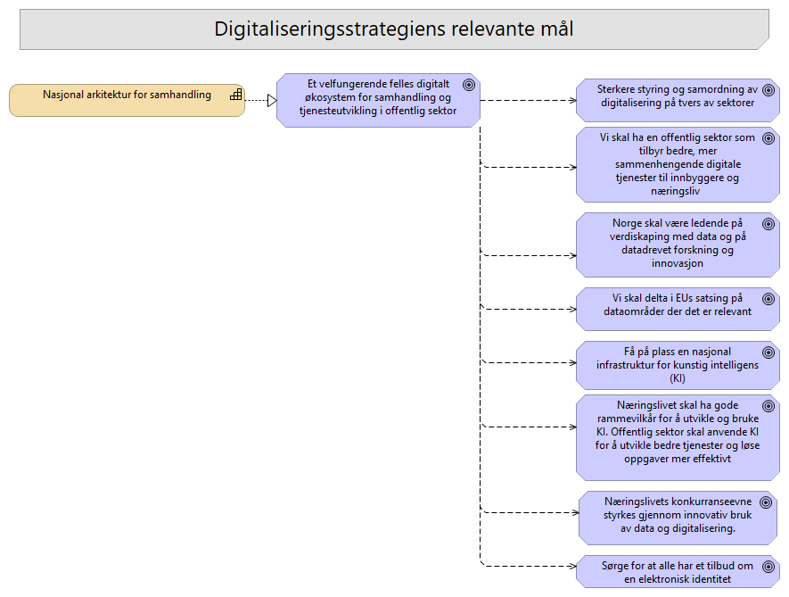

# 04-Digitaliseringsstrategiens mål og NA

## Elementer i viewet

### Sørge for at alle har et tilbud om en elektronisk identitet
**Type:** Goal

---

### Få på plass en nasjonal infrastruktur for kunstig intelligens (KI)
**Type:** Goal

---

### Vi skal delta i EUs satsing på dataområder der det er relevant
**Type:** Goal

Arbeidet med dataområdene i EU vil komme med referansearkitekturer og standarder som må innføres som en del av nasjonal arkitektur.

---

### Nasjonal arkitektur for samhandling
**Type:** Capability

Evne til å sikre samhandling, gjenbruk og strategisk retning i et nasjonalt digitalt økosystem.

Felles økosystem skal bidra til økt deling av data og gjenbruk av løsninger, slik at vi utnytter ressursene på en effektiv måte og skaper økte verdier for samfunnet.
Det betyr at i felles økosystem samarbeider aktørene om å utvikle fellesløsninger som bidrar til en effektiv forvaltning med gode brukervennlige tjenester. Dette inkluderer hvordan vi styrer og forvalter løsninger og tjenester, samt hvordan vi øker samhandlingen mellom aktørene. 
Med samhandling mener vi evnen til å tilby tjenester, utveksle informasjon og ivareta både de organisatoriske, juridiske, semantiske og tekniske aspektene ved dette.

---

### Sterkere styring og samordning av digitalisering på tvers av sektorer
**Type:** Goal

Nasjonal arkitektur er et viktig virkemiddel for å skape sterke synergier mellom norsk og europeisk digitaliseringspolitikk. Den skal bygge på føringer fra EU og fungerer som et rammeverk som integrerer EUs regelverk, standarder og referansearkitekturer i norsk digitaliseringsarbeid. EU-forordninger etablerer nasjonale funksjoner og styringsformer som også dekker Norges behov for koordinering og styring av arkitektur. 
Ved å implementere felles europeiske standarder, sikrer nasjonal arkitektur at norske digitale tjenester kan samhandle effektivt over landegrensene. Samtidig bør Norge bli bedre på å hente erfaringer fra andre land og bruke internasjonale løsninger som utgangspunkt for egen utvikling, noe som reduserer både kostnader og utviklingstid. Gjennom dette sikrer nasjonal arkitektur en helhetlig og framtidsrettet digitalisering som både møter norske behov og Europas digitale agenda. 

---

### Næringslivet skal ha gode rammevilkår for å utvikle og bruke KI. Offentlig sektor skal anvende KI for å utvikle bedre tjenester og løse oppgaver mer effektivt
**Type:** Goal

---

### Et velfungerende felles digitalt økosystem for samhandling og tjenesteutvikling i offentlig sektor
**Type:** Goal

Offentlig sektor må øke digitaliseringstakten. Skal vi kunne utnytte de mulighetene teknologien gir, og bidra til en mer effektiv og bærekraftig digital utvikling, trenger vi en nasjonal arkitektur for samhandling. Arkitekturen bør beskrive nødvendige ressurser for samhandling, som fellesløsninger, infrastruktur for deling av data og standarder, og standardiserte grensesnitt (API-er). Gjennom en nasjonal arkitektur tydeliggjøres sammenhenger og ansvar, og det blir enklere å identifisere behov for tiltak.

Regjeringen vil sikre sterkere styring og samordning av digitaliseringen på tvers av sektorer og forvaltningsnivåer. Nasjonal arkitektur er et av flere viktige virkemidler for å realisere målet og beskriver blant annet nødvendige ressurser for digital samhandling - inkludert fellesløsninger, infrastruktur for datautveksling og felles standarder. Ved å tydeliggjøre sammenhenger, ansvar og tiltak blir det enklere å identifisere behov og koordinere innsatsen på tvers av sektorer og forvaltningsnivåer. Utvikling, forvaltning og prioritering av nasjonal arkitektur bidrar til å gjøre digitaliseringen robust, skalerbar og målrettet, samtidig som det reduserer unødvendig dobbeltarbeid og forenkler brukeropplevelsen. 
Sammen med teamet som jobber med Nasjonalt veikart vil vi aktivt bidra opp under målet ved at vi styrker nasjonal arkitekturstyring og lager kunnskapsgrunnlag for felles prioritering. Vi vil i tillegg samarbeide med andre team som arbeider med organisatoriske, økonomiske og juridiske virkemidler som styrker styring og samordning på tvers. Det er derfor relevant å ha dialog rundt arbeid om for eksempel Digitaliseringsrundskrivet, medfinansieringsordningen, livshendelser og sektorovergripende prosjekter. 
Nasjonal arkitektur har en viktig rolle fordi den legger til rette for at digitaliseringsarbeidet ikke skal skje fragmentert, men som en integrert og koordinert helhet. Den underbygger styringsmekanismene ved å tilby verktøy og prinsipper for beslutninger, tekniske standarder, og hjelper til med å balansere arkitektur lokalt, sektorielt og nasjonalt. 

---

### Vi skal ha en offentlig sektor som tilbyr bedre, mer sammenhengende digitale tjenester til innbyggere og næringsliv  
**Type:** Goal

Målet om sammenhengende tjenester til beste for bruker stiller krav til nasjonal arkitektur.
Nasjonal arkitektur er nødvendig for å få til samhandling og sammenhengende tjenester. Felles økosystem tilbyr ressurser for samhandling og sammenhengende tjenester. Vi skal både tilby ressurser som muliggjør dette, men også sette rammer som styrer offentlig sektor i retning av sammenhengende digitale tjenester. 
Nasjonal arkitektur kan også bidra til å balansere styrkeforholdet mellom store offentlige etater og mindre statlig/kommunale. Gjennom felles standarder, arkitekturer og retningslinjer kan vi bidra til at det blir lettere å dele og bruke data og få til bedre samhandling.
Nasjonal arkitektur bør bidra til utforskning av nye måter å skape sammenheng og forenkling for innbygger og næringsliv. Sammenhengende tjenester introduserer også noen nye utfordringer som bør avklares og nasjonal arkitektur bør foreslå hvordan disse utfordringene adresseres. Ved å samarbeide tett med avdelingen for «Sammenhengende tjenester og livshendelser» og jobbe behovsdrevet med ekte problemer og ekte behov, skal vi aktivt prøve å finne løsninger på de arkitekturmessige hindringene. 

---

### Næringslivets konkurranseevne styrkes gjennom innovativ bruk av data og digitalisering.
**Type:** Goal

Evnen til å tilrettelegge for at det nasjonale økosystemet fremmer et omstillingsdyktig og innovativt næringsliv. 

Dette innebærer:
* rammebetingelser, insentiver og samarbeidsformer som gjør det attraktivt og forutsigbart for private aktører å bygge tjenester oppå nasjonale fellesløsninger og data

Hvorfor er dette viktig?
* Offentlige data som råstoff: Åpne og tilgjengelige data er en ressurs som næringslivet trenger for å skape produkter forvaltningen selv ikke ville utviklet.
* Styrket konkurransekraft: Ved å gjøre offentlige fellesløsninger tilgjengelige for private aktører, økes mulighetene for innovasjon i næringslivet.
I Digitaliseringsstrategien er det et mål at:
*  Regjeringen vil frem mot 2030 legge til rette for at næringslivets konkurranseevne styrkes gjennom innovativ bruk av data og digitalisering. Oppstartsbedrifter skal ha gode rammevilkår. Vi skal sørge for at digitalisering og utnyttelse av data forsterker våre fortrinn i viktige bransjer, slik som helse, energi, havbruk og andre maritime næringer.

---

### Norge skal være ledende på verdiskaping med data og på datadrevet forskning og innovasjon
**Type:** Goal

For å få til datadeling må de riktige ressursene i felles økosystem være på plass. Det gjelder standarder, felles formater, rammeverk, åpne API-er, referansearkitekturer, fellesløsninger mv. Rammeverk for EUs dataområder (data spaces) inneholder også referansearkitekturer og standarder. Nasjonal arkitektur (samhandlingsarkitektur) er nødvendig for å få til datadeling.
Data governance og master data management er nødvendig for at man skal dele data og bruke data, og er viktig for et velfungerende felles økosystem for digital samhandling. Det er pågående arbeid på flere områder innenfor dette målet som bør være koordinert med arbeidet med Nasjonal arkitektur

---

