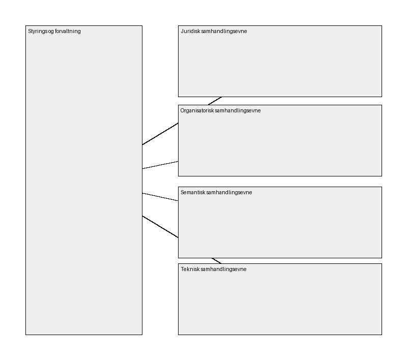

# 05-EIF lagmodell

## Elementer i viewet

### Semantisk samhandlingsevne
**Type:** Grouping

Semantisk samhandlingsevne har å gjøre med betydningen av dataelementer, relasjonen mellom dem og formatet informasjonen utveksles på. Det deles i syntaktisk og semantisk aspekt. Semantisk aspekt skal sikre dataenes betydningsinnhold og interne relasjon, som også innebærer begrepsavklaringer som sikrer at alle parter forstår kommunikasjonen. Syntaktisk aspekt refererer til eksakt format og struktur på data som utveksles.

---

### Styrings og forvaltning
**Type:** Grouping

Styring og forvaltning av integrerbare og sammenhengende offentlige tjenester er det femte området, og løper på tvers av de andre samhandlingsområdene. Det er viktig å komme i gang med avklaringer rundt styring og forvaltning så tidlig som mulig i prosessen ved etablering av nye tjenester. I tillegg vil det være nødvendig å gå mer i dybden etter hvert.

---

### Organisatorisk samhandlingsevne
**Type:** Grouping

Organisatorisk samhandling handler om hvordan samhandlende virksomheter tilpasser tjenestekjeder/forretningsprosesser, ansvar og forventninger for å oppnå felles mål og fordeler. Området dekker også forventninger til å gjøre tjenester tilgjengelige og brukerorienterte, samt hvilke samhandlingsmodeller og avtaler virksomhetene etablerer knyttet til felles forvaltning.

---

### Teknisk samhandlingsevne
**Type:** Grouping

Teknisk samhandlingsevne sikrer at ulike systemer kan integreres. Dette krever teknisk standardisering, noe som i dag blant annet blir understøttet av forskrift om IT-standarder i offentlig forvaltning. Området dekker forhold knyttet til applikasjon, data, teknologi og sikkerhet.

---

### Juridisk samhandlingsevne
**Type:** Grouping

Juridisk samhandling skal sikre at organisasjoner som arbeider under ulik lovgivning kan samhandle. For at organisasjoner på tvers i forvaltningen kan utvikle og bruke like tjenester og funksjonalitet må det rettslige grunnlaget for samhandling mellom aktørene være på plass.

---

