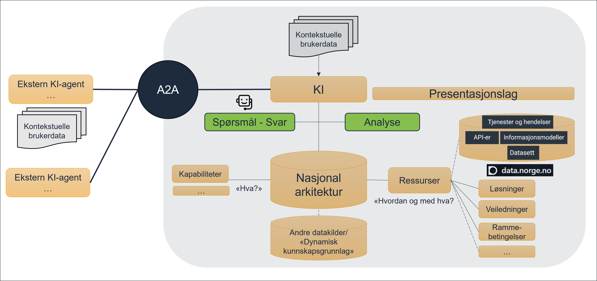
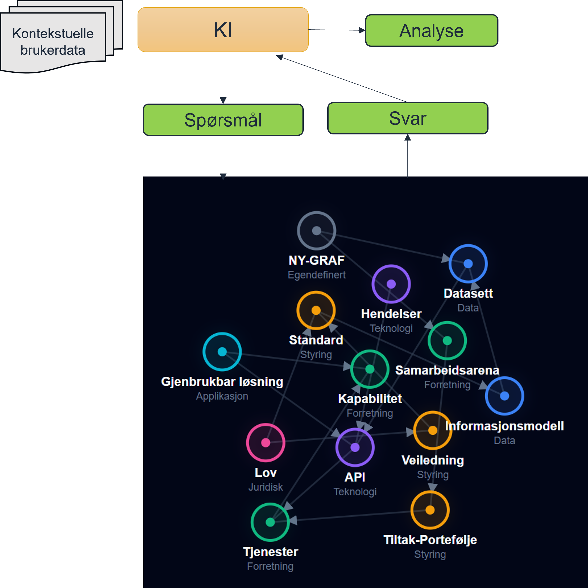

# Nasjonal arkitektur som en kunnskapsgraf

For at Nasjonal arkitektur skal være et levende, maskinlesbart og strategisk verktøy, er målet å etablere den som en **Kunnskapsgraf (Knowledge Graph)**. En kunnskapsgraf gjør arkitekturen til mer enn bare statiske dokumenter eller flate lister; den skaper et nettverk av data hvor sammenhenger (for eksempel mellom en strategisk kapabilitet, et felles API og et underliggende datasett) er formelt definert og maskinelt sporbare.

Dette dokumentet beskriver det strategiske grunnlaget for hvordan vi skal koble den menneskesentrerte arkitekturmodelleringen sammen med en fremtidsrettet, maskinlesbar kunnskapsgraf ved hjelp av ArchiMate og YAML-LD/JSON-LD.

---

## 1. Hvorfor beholde ArchiMate som "master"?

Selv om vi bygger en avansert datadrevet kunnskapsgraf for konsum og KI-analyse, er det en stor fordel å opprettholde selve **ArchiMate-modellen som master**.

* **Menneskelig samhandling og visuell modellering:** Virksomhetsarkitektur (EA) krever dype diskusjoner, planlegging og konsensus blant arkitekter, ledere og domeneeksperter. ArchiMate er den internasjonale de facto-standarden for dette, og verktøyene (f.eks. Archi) gir nødvendige visuelle "views" for å forstå komplekse sammenhenger. Det er urealistisk å be mennesker modellere komplekse grafstrukturer direkte i kode.
* **Kvalitetssikret Single Source of Truth:** Ved å la ArchiMate-filen være kilden til sannhet, sikrer vi en stram og validert struktur. Modellen fungerer som det autoritative utgangspunktet før informasjonen berikes og tilgjengeliggjøres.
* **Skille mellom "produksjon" og "konsum":** Arkitektene produserer og forvalter modellen i sitt naturlige domenespråk (ArchiMate). Deretter brukes automatiserte pipelines til å konvertere denne modellen over til et distribusjonsformat (YAML-LD/JSON-LD) som er mer tilrettelagt for maskinkonsum og kunstig intelligens.

---

## 2. Overgangen fra modell til maskinlesbar graf

For å få dataene ut av ArchiMate (XML) og inn i en kunnskapsgraf eller gi dem til KI-agenter, trenger vi et dataformat som brobygger mellom menneskelig lesbarhet og maskinell semantikk. Vi ønsker å utforske og teste lenkede data til dette. RDF er egnet til dette med en rekke ulike muligheter for serialisering, f.eks. Json-ld (W3C Recommendation), Yaml-ld (W3C Working Draft), Turtle (W3C Recommendation).

### Sammenhengen mellom JSON-LD og YAML-LD

JSON-LD (JavaScript Object Notation for Linked Data) er en W3C-standard for å bygge strukturerte data og kunnskapsgrafer på weben. Det lar oss utvide vanlig JSON med en `@context` (som definerer hva ordene betyr) og `@id` (som gir elementene globale unike lenker). Alt som er JSON-LD kan konverteres direkte til RDF (grunnlaget for grafdatabaser og semantisk web).

YAML-LD er nøyaktig det samme som JSON-LD, men skrevet i **YAML-syntaks**. Konseptuelt er de identiske og kan konverteres sømløst til hverandre, men de har ulike bruksområder i arbeidsflyten.

### Hvorfor benytte YAML/JSON-LD?

Fordelene med å bruke disse formatene ut av ArchiMate-pipelinen er flere:

1. **Menneskelig lesbarhet og versjonskontroll:** Filene er lette å lese for mennesker. Det gjør det også mye enklere å spore endringer i Git (diffs) sammenlignet med andre formater. YAML-LD har ingen parenteser eller anførselstegn som støyer.
2. **Eksplisitt formell semantikk:** I motsetning til standard YAML eller JSON, hvor `type: Capability` bare er tekst, vil YAML/JSON-LD knytte ordet "Capability" til en formell, global ArchiMate-ontologi (via `@context`). Dette fjerner all tvil for maskiner om hva dataene representerer.
3. **Ekte grafer ("Linked Data"):** Relasjoner mellom objekter (f.eks. at Tjeneste A realiserer Kapabilitet B) lagres som graflenker (edges) i stedet for bare tilfeldige tekst-IDer. Modellen slutter å være et isolert dokument, og blir en del av en utvidbar kunnskapsgraf.
4. **Sammenkobling med andre nasjonale kataloger:** Ved å bruke Linked Data (YAML/JSON-LD) kan Nasjonal arkitektur enkelt lenkes direkte til eksterne grafer, for eksempel Felles Datakatalog (DCAT-AP-NO) eller nasjonale begrepskataloger (SKOS).

---

## 3. Tilrettelegging for fremtidens Kunstige Intelligens (KI)

Valget av en Kunnskapsgraf og YAML/JSON-LD som representasjon av ArchiMate-modellen legger fundamentet for å bruke avansert KI i arkitekturarbeidet:

* **Sikker og deterministisk AI-analyse:** Rene språkmodeller (LLMs) kan "hallusinere" hvis de må gjette seg frem til relasjoner basert på vanlig tekst. Hvis arkitekturen eksisterer som en JSON-LD/YAML-LD-drevet kunnskapsgraf, kan KI-en (gjennom såkalt *Graph RAG* - Retrieval-Augmented Generation) kjøre presise, strukturerte spørringer (som SPARQL) mot grafen.
* **Besvarelse av komplekse spørsmål:** KI-systemer vil med 100 % nøyaktighet kunne besvare spørsmål som: *"Hvilke underliggende databaser og tjenester må moderniseres dersom vi ønsker å styrke den strategiske kapabiliteten X, og hvilke aktører påvirkes?"*
* **Kompakt for LLM-prompts:** Om KI-en skal lese rådataene direkte (utenom en grafdatabase), er YAML/JSON-LD ideelt. Den kompakte strukturen sparer verdifulle "tokens" (spesielt YAML-LD), mens den påklistrede `@context`-semantikken sikrer at språkmodellen har den nøyaktige meningsbærende konteksten den trenger for å unngå feiltolkninger.

<figure>
  
    
  
  <figcaption>Bruk av KI - Datadrevet kunnskap på tvers: Gjør arkitekturen umiddelbart operativ for ulike brukere og ulike behov</figcaption>
</figure>

## Oppsummering av dataflyt for fremtiden

1. **Modellering (Master):** Arkitekter jobber i ArchiMate.
2. **Eksport (Git-pipeline):** Script trekker ut dataene og lagrer dem som **YAML/JSON-LD**.
3. **Konsum & Distribusjon:** YAML/JSON-LD (kan) lastes inn i en felles grafdatabase.
4. **Bruk:** Applikasjoner, KI-agenter (Graph RAG), og utviklere kan spørre grafen for sanntids, semantisk korrekt innsikt i Nasjonal arkitektur.

## Representasjon av ArchiMate-modeller i JSON/YAML-LD

Dette dokumentet oppsummerer vår tilnærming for å hente ut, representere og analysere innholdet fra våre ArchiMate-modeller. Målet er å gå vekk fra den komplekse XML-strukturen og over til maskinlesbar, semantisk data ved hjelp av **JSON/YAML-LD** (Linked Data).

### Hvorfor JSON/YAML-LD?

Tradisjonell eksport til vanlig JSON eller YAML fungerer godt for enkle uttrekk. Imidlertid gir JSON/YAML-LD oss muligheten til å representere modellen som en graf (basert på RDF-prinsipper), noe som kobler dataene våre til det semantiske nettet. Dette gjør informasjonen langt mer kraftfull for både intern analyse, maskinell tolkning (inkludert KI) og fremtidig datadeling (for eksempel mot Felles Datakatalog).

### Utfordringen med relasjoner

En utbredt misforståelse er at RDF-baserte formater er dårlige til å håndtere de komplekse relasjonene vi finner i ArchiMate. Dette stemmer ikke. Grafmodeller er skreddersydd for komplekse relasjoner.

I ArchiMate er relasjoner mer enn bare en usynlig strek mellom to bokser; de har ofte egne navn, dokumentasjon og egenskaper. For å ivareta dette i JSON/YAML-LD modelleres relasjonene som egne, selvstendige objekter (noder) med en egen unik ID (`@id`). På denne måten bevares absolutt alt innhold og all struktur – inkludert hierarki og dokumentasjon på selve relasjonen – på en ryddig måte.

### Fase 1: Kortsiktig plan (Pragmatisk tilnærming)

På kort sikt er målet å tilgjengeliggjøre dataene for lokal analyse, scripts og KI-verktøy.

* **Enkel og lokal `@context`**: Vi starter med å bygge JSON/YAML-LD-filer der vokabularet (`@context`) er relativt enkelt. Vi mapper nøkkelordene våre til en midlertidig og lokal adresse (URI), i stedet for å bruke tid på å bygge en feilfri, globalt anerkjent ontologi fra dag én.
* **Full tolkningsevne**: Selv med en lokal og midlertidig `@context`, vil KI-assistenter og lokale skript fungere optimalt. Strukturen og grafen i JSON/YAML-LD-filen er konsekvent. Modeller og KI vil enkelt kunne traversere hierarkier, se sammenhenger mellom kapabiliteter og tjenester, og trekke ut tilhørende dokumentasjon.
* **Verdi fra dag én**: Vi kan umiddelbart begynne å gjøre tekstanalyse, søk og kvalitetssikring av innholdet uavhengig av Archi-verktøyet.

### Fase 2: Langsiktig plan (Semantisk interoperabilitet)

Når strukturen er etablert og vi ser at informasjonen flyter godt, modner vi modellen for deling med omverdenen.

* **Gjenbruk av standardiserte ontologier**: Siden ArchiMate er en internasjonal standard, vil vi oppdatere vår `@context` til å peke på eksisterende, publiserte RDF-vokabularer (for eksempel fra The Open Group). Dermed forstår systemer over hele verden våre basisbegreper (som *Business Capability* eller *Serving Relationship*).
* **Definere lokale utvidelser**: Egenskaper og attributter som er unike for vårt domene (for eksempel særnorske lovhjemler, sikkerhetsnivåer eller spesifikke tags), definerer vi i en egen, formell ontologi som utvider standarden.
* **Sømløs systemintegrasjon**: Med en formell ontologi på plass vil systemet vårt automatisk og maskinelt kunne utveksle data med andre nasjonale fellesløsninger, referansearkitekturer og kataloger. Selve datafilene trenger minimal endring; det er hovedsakelig `@context`-definisjonen i toppen av filene som oppgraderes.

<small>Sist oppdatert: 16. juli 2026</small>
